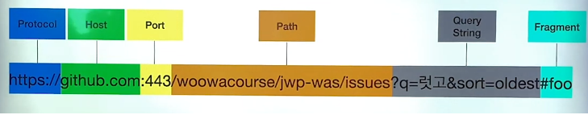
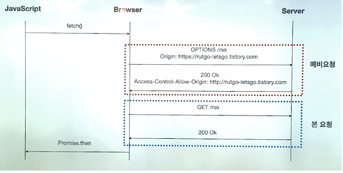
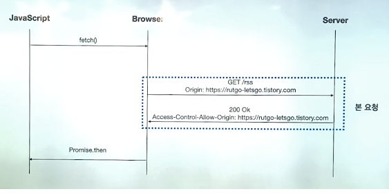
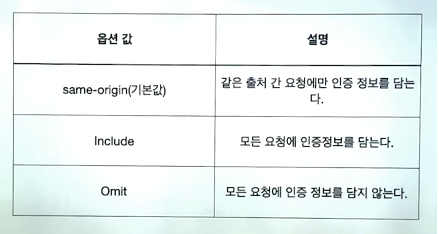
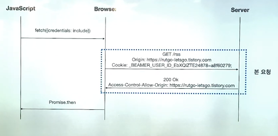

# CORS

### 1. 출처(Origin)



- 보통 **Protocal**과 **Host**, **Port**가 같다면 같은 출저라고 봅니다.
  - 하지만 Port부분은 예외사항이 있습니다.
  - Port는 브라우저가 만든 정책에 따라 달라집니다.
    - 거의 모든 브라우져는 Port까지 같아야 같은 출저로 인식하고 있다.
    - 인터넷 익스플로어는 Port는 취급하지 않는다.

```js
// 자바스크립트로 출저 확인 가능
console.log(location.origin)
```


### 2. SOP ( Same - Origin Policy)

- 웹 같은 경우에는 오픈되어 있는 공간이다보니 이것을 악용하여 여러 공격들이 들어올 수 있기 때문에 같은 출저 경우에만 리소스를 받을 수 있도록 하는 정책입니다.
- 브라우저에서 HTTP, HTTPS의 통신은 모두 이 정책을 받게됩니다.
  - 그래서 다른 출저간에도 리소스를 보여주기 위해 예외 조항들이 생겼습니다.
  - CORS 정책을 지킨 요청
  - 실행 가능한 스크립트
  - 랜더될 이미지
  - 스타일 시트


### 3. CORS와 SOP가 나온 이유

- CSRF, XSS 등 보안 취약점을 공격할 수 있는 방법들을 예방하고자 생겨나게 되었습니다.

  - CSRF(Cross Site Request Forgery) : 사이트 간 요청 위조, 웹 사이트 취약점 공격의 하나로, 사용자가 자신의 의지와 무관하게 공격자가 의도한 행위 (수정, 삭제, 등록 등)를 특정 웹사이트에 요청하게 하는 공격

  - XSS(Cross Site Scripting) : 웹 상에서 취약점 공격의 일종으로, 악의적인 사용자가 공격하려는 사이트에 악성 스크립트를 넣는 기법을 말한다. (2011년 네이버 웹툰 HTML 태그 테러)
    - 쿠키에 HttpOnly 옵션을 활성화하여 방지할 수 있다.
      - 본질을 막는 방법은 아니지만 스크립트를 통해 쿠키에 접근할 수 없습니다.


### 4. CORS( Cross - Origin Resource Sharing )

- 교차 출저 자원 공유 : 모든 출처에 대한 자원을 받으면 보안상 위험하니 원하는 출처들의 자원들만 받겠다는 정책입니다.

- Request 메세지 : Origin header
- Response 메세지 : Access-Control-Allow-Origin header
- 이 두개의 Header가 같아야 브라우저는 같은 출처라고 인식을 합니다.


### 시나리오

#### Preflight Request ( 예비 요청 )



- 자바스크립트로 자원을`fetch()`로 요청
- `OPTIONS`메소드를 활용해서 예비요청을 보냅니다.
  - `Access-Control-Request-Method`  도 같이 보냅니다.
    - 본 요청에 사용할 메소드
  - `Access-Control-Request-Headers `도 같이 보냅니다.
    - 본 요청에 사용할 헤더들
  - 이때에 `Origin`해더에 해당 클라이언트의 출저를 같이 보냅니다.
- 서버는 `Access-Control-Allow-Origin` header로 응답을 해줍니다.
  - 브라우저에서 이 응답을 받았을 때 출저가 같다면 같은 출저라고 판단해서 **CORS 정책**에 위반되지 않았다고 판단합니다. => 그다음 정상적으로 자원을 다시 요청하고 응답합니다. 만약 출저가 다를 경우 경고 및 오류가 발생하고 자원을 요청하지 않습니다.
- 클라이언트나 서버에서 판단하는 것이 아니라 브라우저에서 동일 출처를 확인합니다.
  - 그래서 서버는 **200 OK**를 보냅니다.
- 중요 : 매번`preflight` 요청을 보내는 것은 아닙니다. 서버 설정을 통해 `preflight`결과를 캐시해서 일정 기간동안 저장할 수 있습니다. 이 캐시 정보가 살아 있는 시간 동안은 `preflight`을 생략하고 바로 요청 전송이 가능합니다.
  - Spring은 `@CrossOrigin` Annotation 활용한 maxAge 설정


#### Simple Request



- 예비요청이 없고 본 요청에서 예비요청을 같이 한번에 진행합니다.

- 제약사항이 많아서 실질적으로 볼 일이 거의 없다 => 이 조건을 만족해아 예비요청 생략 가능
  - 요청의 메소드는 GET, HEAD, POST 중 하나여야 한다.
  - `Accept`, `Accept-Language`,` Content-Language`, `Content-Type`, `DPR`, `Downlink`, `Save-Data`, `Viewport-Width`, `Width`를 제외한 헤더는 사용하면 안됩니다.
    - **JWT** 토큰틀 보내는 Header를 사용하지 못하기 때문에 REST API에선 잘 사용하지 않습니다.
  - 만약 Content-Type을 사용하는 경우에는 `application/x-www-form-urlencoded`,` multipart/form-data`, `text/plain`  이 3개만 허용된다.


### Credentialed Request



- 좀 더 보안을 강화시킨 CORS 정책 입니다.

- 보통 비동기 API들은 기본적으로 쿠키를 담아서 요청을 보내지 않습니다. 그래서 쿠키를 담을 수 있게 위와 같은 여러 `Option`값을 줘야 합니다.
  - 서버에서 `Option`값을 바탕으로 이 요청을 준 사람이 인증이 된 사용자인지 체크를 하게 됩니다.



- `fetch`안에다가 `credentials: include`라는 옵션값을 주고 요청합니다.
- 브라우저는 쿠키를 같이 담아서 요청을 보냅니다.
- 서버는 제대로 응답을 보내고 브라우저는 **CORS** 정책에 위반되었는지 검사합니다.
- 제약사항이 존재합니다.
  - `Access-Control-Allow-Origin`에는 *를 사용할 수 없으며, 명시적인 URL이어야 한다. (보안적으로 더 막기 위함으로 와일드 카드를 사용할 수 없다.)
    - `Access-Control-Allow-Origin : *`이것은 모든 출저에 대해서 허용하겠다라는 의미
  - 응답 헤더에는 반드시 `Access-Control-Allow-Crendentials: true`가 존재해야 한다. (무조건 인증을 해야한다.)


### 결론

### 5. CORS란?

- 서버 입장 : 프론트 개발자를 위해 응답 헤더에 올바른 `Access-Control-Allow-Origin`이 내려올 수 있도록 세팅해야 합니다. 그래야 프론트에서 위반했는지 확인할 수 있다.
- 클라이언트 입장 : Webpack Dev Server로 리버스 프록싱 하여 우회가 가능하다. 그러나 이러한 방법은 로컬환경에서만 가능하다. 가장 좋은 방법은 서버 개발자에게 도움을 요청하자!
- SOP에 의해 보안상의 이유로 한 origin이 다른 origin의 리소스와 상호작용할 수 없는데 그때, 추가 HTTP 헤더를 사용해 한 origin에서 실행중인 웹 애플리케이션이 다른 origin의 자원에 접근할 수 있는 권한을 부여하도록 브라우저에게 알려주는 체제입니다.
- CORS 정책 위반으로 인해 문제가 생기면 백엔드 개발자와 으쌰으쌰해서 해결하자!!


### 출저

- https://www.youtube.com/watch?v=7iGIfcEsc2g