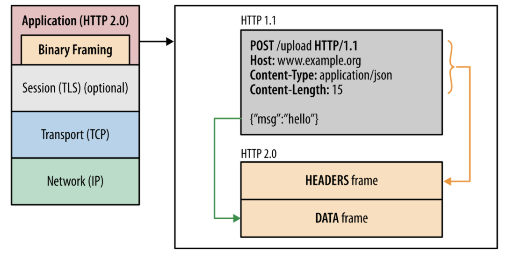
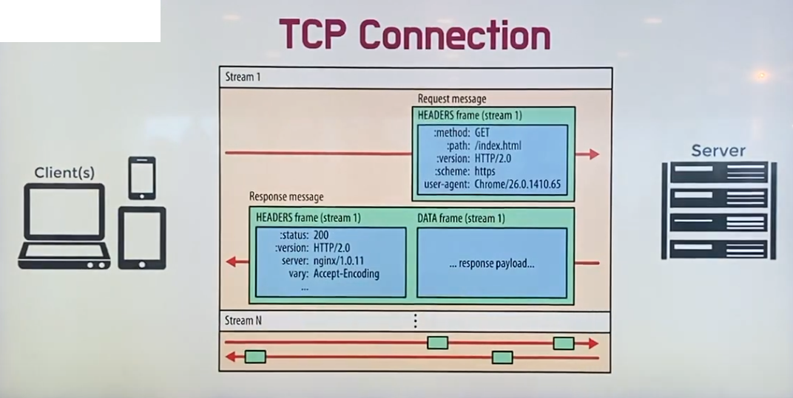
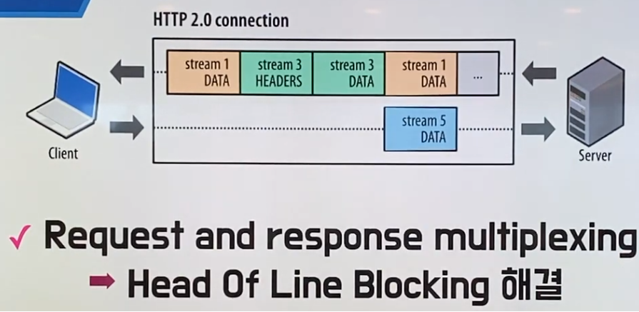
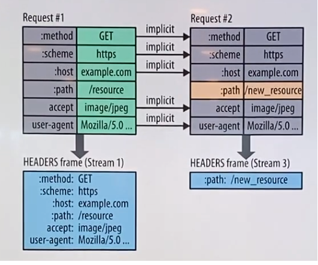
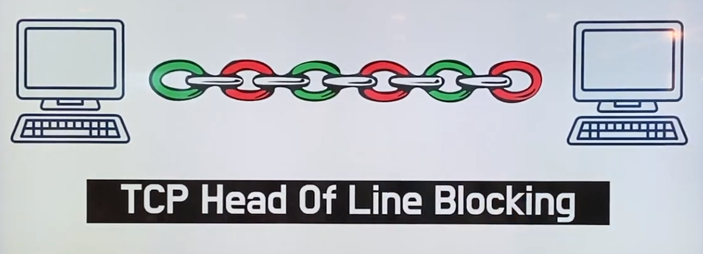

# HTTP 버전

- HTTP 0.9~2 버전 까지는 기본적으로 **TCP** 전송 프로토콜을 사용합니다.

### 1. HTTP/0.9

- 요청과 응답이 심플하다. ( GET만 존재 )
- html 문서만 주고받습니다.

```
GET /mypage.html
```


### 2. HTTP/1.0

- header가 추가됩니다.
- 다른 타입의 파일도 전송이 가능합니다.

```
GET /mypage.html HTTP/1.0
User-Agent: Mosasic/2.0 ( windows 3.1 )
```

```
200 OK
Date: Tue, 15 Nov 1994 08:12:31 GMT
Server: CERN/3.0 libwww/2.17
Content-Type: text/html
<HTML>
	
```

- 문제가 커넥션 한개당 요청1개와 응답 1개만 처리 가능합니다.
  - 매번 새로운 연결로 성능 저하
  - 서버 부하 비용 증가
- 이것을 극복하기 위해 나온 것이 HTML/1.1


### 3. HTTP/1.1

- Persistent Connection : 지정한 timeout 동안 커넥션을 닫지 않는 방식
- Pipelining 도입 : 하나의 커넥션에서 응답을 기다리지 않고 순차적으로 여러 요청을 연속적으로 보내 그 순서에 맞춰 응답을 받는 방식으로 지연시간을 줄일 수 있습니다.
  - 하지만 치명적 문제 발생 : Head Of Line Blocking ( 첫번째 요청의 처리시간이 엄청 길어지면 2번째, 3번째 요청도 기다려야하는 문제)
  - 또한 또다른 연속된 요청이 생기면 중복된 Header 구조가 생기고 이것때문에 주고받는 데이터가 쓸데없이 커지는 현상 발생


### 4. HTTP/2

- 2015년에 등장
- 기존 HTTP/1.X 버전의 성능 향상에 초점을 맞춘 프로토콜
- 표준의 대체가 아닌 확장을 의미합니다.
- 네이버, 페이스북, 인스타그램등에서 자주 사용합니다.
- 꼭 SSL 이 적용되어야 하는 것 은 아닙니다. 하지만 웹사이트를 지원하는 브라우져들 (구글의 크롬, 마소의 IE, 모질라의 파폭) 은 https 에서만 HTTP/2 규격을 지원하기로 결정한 상태 입니다.
  - HTTP/2에서는 TLS 1.2버전 혹은 그 이상의 버전을 요구하고 있다. 
  - 주요 웹브라우저는 TLS 1.0 ~ 1.1 지원 종료 중...


### 특징



- HTTP 메시지 전송 방식의 변화
  - 바이너리 프레이밍 계층 사용 : 메세지를 프레임이라는 단위로 분할합니다. ( 이것을 바이너리로 인코딩 )
  - 컴퓨터는 텍스트보다 바이너리를 더 좋아하기 때문에 파싱 및 전송속도 증가, 오류발생 감소




- 클라이언트와 서버가 연결되는 커넥션 안에 스트림이라는 데이터 양방뱡 흐름이 존재하는데 프레임들이 들어가 조각들이 합쳐져 요청이나 응답 메세지가 됩니다.




- 프레임으로 쪼개져 있기 때문에 어떤 메세지간의 순서가 사라집니다.
- 또한 프레임이 끼어드는 방식이 가능해서 먼저 도착한 것이 조립이 됩니다.
  - Head Of Line Blocking이 해결됩니다.
- Stream Prioritization도 중요한 특징입니다.
  - 리소스간 우선 순위를 설정 가능합니다.
  - 특정 스트림에 가중치를 설정해서 먼저 빠르게 응답하도록 설정 가능합니다.
- Server Push 기능도 있습니다.
  - 클라이언트가 요청하지 않은 리소스를 서버에서 알아서 푸쉬해서 보낼 수 있습니다.
  - 또 요청할 것을 클라이언트에게 미리 줘버릴 수 있다.




- Header Compression : 헤더의 크기를 줄여 페이지 로드 시간 감소
  - 압축 방법 : stattic 및 dynamic table를 통해 중복을 검출해서 중복된 것은 index만 넣고 중복되지 않은 것은 허프만인코딩으로 인코딩해서 메세지를 생성 ( 헤더의 크기가 85% 정도 감소 )

- 퍼포먼스 차이에서도 엄청난 차이가 있다.
  - 수많은 이미지로 실험시 훨씬 빠르게 로드됩니다.


# QUIC( 퀵 )

- 전송 계층 프로토콜
- 2013년에 공개되었고 구글에서 만들었습니다.
- UDP 기반입니다. ( 신뢰성이 낮고 전송속도는 빠르다. )
  - TCP는 신뢰성을 확보하지만 지연을 줄이기 힘든 구조이다. ( 이미 기능이 꽉차있다. 신뢰성 확보 때문에 )
  - UDP는 데이터 전송에만 집중한 설계이기 때문에 별도의 기능이 없습니다.
    - 그래서 개발자가 원하는 기능을 구현할 수 있습니다.
    - TCP의 지연을 줄이면서 TCP만큼 신뢰성을 확보 가능!

- 전송속도가 향상 : 첫 연결 설정에서 필요한 정보와 함께 데이터를 한번에 전송 => 연결 성공시 설정을 캐싱하여 다음 연결 때 바로 성립 가능 ( 3 WAY HANDSHAKE 불필요 )

  - Connection UUID라는 고유한 식별자로 서버와 연결 : 클라이언트가 가지고 있으면 커넥션을 재 수립할 필요가 없습니다.

- 보안 향상

  - TLS 기본 적용
  - IP Spoofing / Replay Attack  방지 ( 소스 어드레스 토큰을 필요에 따라 발급을 합니다. )

  



- 독립 스트림을 사용 => 향상된 멀티 플렉싱 가능
  - HTTP/2에서 멀티 플렉싱이 가능하지만 2개의 스트림을 병렬로 처리가 되고 있을 때 중간에 스트림 한개가 없어질 경우 없어진 것을 다시 찾아오기 전까지 기다려야 합니다.


- 노란색 스트림에 문제가 생겨서 대기를 타도 파란색 스트림은 아무 상관없이 진행할 수 있습니다.
- 이 프로토콜을 사용해서 구글은 로딩 시간 평균 3% 개선 및 유튜브 버퍼링 평균 30% 개선


## HTTP/3

- 2018년에 QUIC을 바탕으로 HTTP/3 등장!
- 구글은 이미 사용하고 있습니다.


- 참고
  - https://www.youtube.com/watch?v=xcrjamphIp4
  - https://www.whatap.io/ko/blog/38/