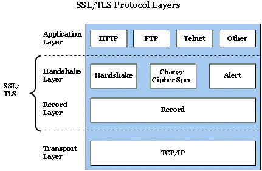

# HTTPS란 ?

- HTTP는 Hypertext Transfer Protocol의 약자다. 즉 Hypertext 인 HTML을 전송하기 위한 통신규약을 의미한다. 
- HTTP**S**에서 마지막의 S는 Over Secure Socket Layer의 약자로 Secure라는 말을 통해서 알 수 있듯이 보안이 강화된 HTTP라는 것을 짐작할 수 있다. HTTP는 암호화되지 않은 방법으로 데이터를 전송하기 때문에 서버와 클라이언트가 주고 받는 메시지를 감청하는 것이 매우 쉽다. 예를들어 로그인을 위해서 서버로 비밀번호를 전송하거나, 또는 중요한 기밀 문서를 열람하는 과정에서 악의적인 감청이나 데이터의 변조등이 일어날 수 있다는 것이다. 이를 보안한 것이 HTTPS다.

### 1. SSL

- 웹이 인터넷 위에서 돌아가는 서비스 중의 하나인 것처럼 HTTPS도 SSL 프로토콜 위에서 돌아가는 프로토콜이다.
- SSL과 TLS은 같은 말입니다.
  - SSL은 네스케이프에 의해 발명되었습니다. 이것이 점차 폭넓게 사용되다가 표준화 기구인 IETF의 관리로 변경되면서 TLS라는 이름으로 바뀌었다. TLS 1.0은 SSL 3.0을 계승한다. 하지만 TLS라는 이름보다 SSL이라는 이름이 훨씬 많이 사용되고 있다.

### 2. SSL 디지털 인증서

- 클라이언트와 서버간의 통신을 제3자가 보증해주는 전자화된 문서다.
- 클라이언트가 서버에 접속한 직후에 서버는 클라이언트에게 이 인증서 정보를 전달한다. 클라이언트는 이 인증서 정보가 신뢰할 수 있는 것인지를 검증 한 후에 다음 절차를 수행하게 된다. SSL과 SSL 디지털 인증서를 이용했을 때의 이점은 아래와 같다.
  - 통신 내용이 공격자에게 노출되는 것을 막을 수 있다. 
  - 클라이언트가 접속하려는 서버가 신뢰 할 수 있는 서버인지를 판단할 수 있다.
  - 통신 내용의 악의적인 변경을 방지할 수 있다. 

### 3. SSL에서 사용하는 암호화의 종류

- SSL의 핵심은 암호화다. SSL은 보안과 성능상의 이유로 두가지 암호화 기법을 혼용해서 사용하고 있는데 SSL 동작방법을 이해하기 위해서는 이 암호화 기법들에 대한 이해가 필요하다. 
- 이 방법을 모르면 SSL의 동작방법이 추상적으로 느껴질 것이다. SSL에 대한 구체적인 이해를 할 수 있도록 SSL에서 사용하는 암호화 기법들을 소개하겠다. 이것은 비단 SSL의 이해 뿐 아니라 IT 담당자의 기본 소양에 해당하기 때문에 도전해보자.

### 대칭키

- 암호를 만드는 행위인 **암호화**를 할 때 사용하는 일종의 비밀번호를 키(key)라고 한다.
- 이 키에 따라서 암호화된 결과가 달라지기 때문에 키를 모르면 암호를 푸는 행위인 **복호화**를 할 수 없다. 
- 대칭키는 동일한 키로 암호화와 복호화를 같이 할 수 있는 방식의 암호화 기법을 의미한다. 
  - 즉 암호화를 할 때 1234라는 값을 사용했다면 복호화를 할 때 1234라는 값을 입력해야 한다는 것이다. 
  - 키값이 노출되면 암호를 해독할 수 있기 때문에 이것이 치명적인 단점입니다.

### 공개키

- 대칭키 방식은 단점이 있다. 암호를 주고 받는 사람들 사이에 대칭키를 전달하는 것이 어렵다는 점이다.
- 대칭키가 유출되면 키를 획득한 공격자는 암호의 내용을 복호화 할 수 있기 때문에 암호가 무용지물이 되기 때문이다. 이런 배경에서 나온 암호화 방식이 공개키방식이다.
- 공개키 방식은 **두개의 키**를 갖게 되는데 A키로 암호화를 하면 B키로 복호화 할 수 있고, B키로 암호화하면 A키로 복호화 할 수 있는 방식이다. 
- 이 방식에 착안해서 두개의 키 중 하나를 비공개키(private key, 개인키, 비밀키라고도 부른다)로하고, 나머지를 공개키(public key)로 지정한다. 
- 비공개키는 자신만이 가지고 있고, 공개키를 타인에게 제공한다. 
- 공개키를 제공 받은 타인은 공개키를 이용해서 정보를 암호화한다. 암호화한 정보를 비공개키를 가지고 있는 사람에게 전송한다. 비공개키의 소유자는 이 키를 이용해서 암호화된 정보를 복호화 한다. 이 과정에서 공개키가 유출된다고해도 비공개키를 모르면 정보를 복호화 할 수 없기 때문에 안전하다. **공개키로는 암호화는 할 수 있지만 복호화는 할 수 없기 때문이다.**
- **인증**에서 응용할수 있습니다. ( 반대로 응용 )
  - 비공개키의 소유자는 비공개키를 이용해서 정보를 암호화 한 후에 공개키와 함께 암호화된 정보를 전송한다. ( 누구나 복호화 가능 => 비밀키를 가지고 있는 사람이 보낸 정보라는 것을 보증할 수 있다 (인증))
  - 정보와 공개키를 획득한 사람은 공개키를 이용해서 암호화된 정보를 복호화 한다. 
  - 이 과정에서 공개키가 유출된다면 의도하지 않은 공격자에 의해서 데이터가 복호화 될 위험이 있다. 이런 위험에도 불구하고 비공개키를 이용해서 암호화를 하는 이유는 무엇일까? 
  - 그것은 이것이 데이터를 보호하는 것이 목적이 아니기 때문이다. 암호화된 데이터를 공개키를 가지고 복호화 할 수 있다는 것은 그 데이터가 공개키와 쌍을 이루는 비공개키에 의해서 암호화 되었다는 것을 의미한다. 즉 공개키가 데이터를 제공한 사람의 신원을 보장해주게 되는 것이다. 이러한 것을 **전자 서명**이라고 부른다.

- 참고
  - https://opentutorials.org/course/228/4894 ( 생활코딩 강의 )