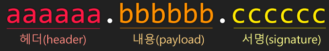
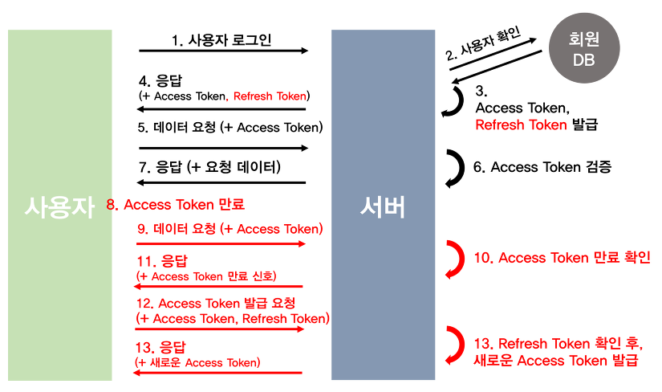

# JWT (토큰 기반 인증)


### 1. 토큰 기반 인증 시스템을 선택하는 이유

- Stateless 서버 특징을 이용하면 서버와 클라이언트는 연결고리가 없기 때문에 **확장성**이 높아집니다.
  - 서버를 아무리 여러대 늘려도 아무 서버에서 사용가능합니다.
  - 하지만 서버 쪽에서 문제가 내가 로그인해서 이 토큰을 받았고 이 토큰은 60분만 사용할 수 있어! 라는 정보를 저장해야 합니다. ( 간단한 방법, DB에 저장=> 확장성 문제 발생 => 레디스 활용.. )
  - **JWT Token**을 활용하면 Json 형태로 파트 3개로 분리해서 다양한 정보들이 들어가 있어 기존 문제점을 해결할 수 있었습니다. ( 어떤 리소스의 권한이 있는지 까지 담겨있다. )
- Android / iOS 모바일 어플리케이션을 개발 한다면, 안전한 API 를 만들기 위해선 쿠키같은 인증시스템은 이상적이지 않습니다. (쿠키 컨테이너를 사용해야하죠). 토큰 기반 인증을 도입한다면, 더욱 간단하게 이 번거로움을 해결 할 수 있습니다.
- OAuth의 활용 : 페이스북/구글 같은 소셜 계정들을 이용하여 다른 웹서비스에서도 로그인 할 수 있게 할 수 있습니다.
- 토큰 기반 인증 시스템을 사용하여 어플리케이션의 보안을 높일 수 있습니다. 단, 이 토큰 기반 인증을 사용한다고 해서 무조건 해킹의 위험에서 벗어나는건 아닙니다.


### 2. 기존 서버 기반 인증의 문제점

#### 세션

- 유저가 인증을 할 때, 서버는 이 기록을 서버에 저장을 해야합니다. 이를 **세션** 이라고 부릅니다. 대부분의 경우엔 메모리에 이를 저장하는데, 로그인 중인 유저의 수가 늘어난다면 어떻게될까요? 서버의 램이 과부화가 되겠지요? 이를 피하기 위해서, 세션을 데이터베이스에 시스템에 저장하는 방식도 있지만, 이 또한 유저의 수가 많으면 데이터베이스의 성능에 무리를 줄 수 있습니다.
- 세션을 사용할 때 서버가 여러개면은 보통 한서버에 세션이 저장되기 때문에 만약 접속자수가 몰려서 다른 서버로 연결이 된다면 그 사람의 인증정보는 없어질 것이다. 그래서 아무리 과부하가 걸려서 무조건 그 서버만 사용할 수 있도록 설정을 했다고 한다.

#### 확장성

- 세션을 사용하면 서버를 확장하는것이 어려워집니다. 여기서 서버의 확장이란, 단순히 서버의 사양을 업그레이드 하는것이 아니라, 더 많은 트래픽을 감당하기 위하여 여러개의 프로세스를 돌리거나, 여러대의 서버 컴퓨터를 추가 하는것을 의미합니다. 세션을 사용하면서 분산된 시스템을 설계하는건 불가능한것은 아니지만 과정이 매우 복잡해집니다.

**CORS (Cross-Origin Resource Sharing)**

- 웹 어플리케이션에서 세션을 관리 할 때 자주 사용되는 쿠키는 단일 도메인 및 서브 도메인에서만 작동하도록 설계되어있습니다. 따라서 쿠키를 여러 도메인에서 관리하는것은 좀 번거롭습니다.


### 3. 토큰 기반 시스템의 작동 원리

- 토큰 기반 시스템은 **stateless** 합니다. 무상태. 즉 상태유지를 하지 않습니다. 이 시스템에서는 더 이상 유저의 인증 정보를 서버나 세션에 담아두지 않습니다.
-  이 개념 하나만으로도 위에서 서술한 서버에서 유저의 인증 정보를 서버측에 담아둠으로서 발생하는 많은 문제점들이 해소됩니다. => 손쉽게 확장 가능


#### 토큰 기반 시스템 구현 방식

1. 유저가 아이디와 비밀번호로 **로그인**을 합니다
2. 서버측에서 해당 **계정정보를 검증**합니다.
3. 계정정보가 정확하다면, 서버측에서 유저에게 *signed* **토큰을 발급**해줍니다.
   - signed : 해당 토큰이 서버에서 정상적으로 발급된 토큰임을 증명하는 signature 를 지니고 있다는 것입니다
4. 클라이언트 측에서 전달받은 **토큰을 저장**해두고, 서버에 요청을 할 때 마다, 해당 **토큰을 함께 서버에 전달**합니다.
5. 서버는 **토큰을 검증**하고, **요청에 응답**합니다.
   1. 웹서버에서 토큰을 서버에 전달 할 때에는, HTTP 요청의 헤더에 토큰값을 포함시켜서 전달합니다.


### 4. 토큰의 장점

- 무상태(stateless) 이며 확장성(scalability)이 있다

- 클라이언트가 서버에 요청을 보낼 때, 더 이상 쿠키를 전달하지 않음으로 쿠키를 사용함으로 인해 발생하는 취약점이 사라집니다. 하지만, 토큰을 사용하는 환경에서도 취약점이 존재 할 수 있으니 언제나 취약점에 대비해야 합니다
  - 토큰 내 중요한 정보 노출
  - 토큰 내 값 조작으로 인가되지 않은 접근 권한 획득
- 어플리케이션과 서비스의 규모가 커지면, 우리는 여러 디바이스를 호환 시키고, 더 많은 종류의 서비스를 제공하게 됩니다. 토큰을 사용한다면, 그 어떤 디바이스에서도, 그 어떤 도메인에서도, 토큰만 유효하다면 요청이 정상적으로 처리 됩니다. 서버측에서 어플리케이션의 응답부분에 다음 헤더만 포함시켜주면 됩니다.

```js
Access-Control-Allow-Origin: *
```


### 5. JWT

- JSON Web Token (JWT) 은 웹표준 ([RFC 7519](https://tools.ietf.org/html/rfc7519)) 으로서 두 개체에서 JSON 객체를 사용하여 가볍고 자가수용적인 (self-contained) 방식으로 정보를 안전성 있게 전달해줍니다.
- JWT 는 필요한 모든 정보를 자체적으로 지니고 있습니다. JWT 시스템에서 발급된 토큰은, 토큰에 대한 기본정보, 전달 할 정보 (로그인시스템에서는 유저 정보를 나타내겠죠?) 그리고 토큰이 검증됐다는것을 증명해주는 signature 를 포함하고있습니다.
- JWT 는 자가수용적이므로, 두 개체 사이에서 손쉽게 전달 될 수 있습니다. 웹서버의 경우 HTTP의 헤더에 넣어서 전달 할 수도 있고, URL 의 파라미터로 전달 할 수도 있습니다.


### JWT 는 어떤 상황에서 사용될까?

- **회원 인증:** JWT 를 사용하는 가장 흔한 시나리오 입니다. 유저가 로그인을 하면, 서버는 유저의 정보에 기반한 토큰을 발급하여 유저에게 전달해줍니다. 그 후, 유저가 서버에 요청을 할 때 마다 JWT를 포함하여 전달합니다. 서버가 클라이언트에게서 요청을 받을때 마다, 해당 토큰이 유효하고 인증됐는지 검증을 하고, 유저가 요청한 작업에 권한이 있는지 확인하여 작업을 처리합니다.
  서버측에서는 유저의 세션을 유지 할 필요가 없습니다. 즉 유저가 로그인되어있는지 안되어있는지 신경 쓸 필요가 없고, 유저가 요청을 했을때 토큰만 확인하면 되니, 세션 관리가 필요 없어서 서버 자원을 많이 아낄 수 있습니다.
- **정보 교류**: JWT는 두 개체 사이에서 안정성있게 정보를 교환하기에 좋은 방법입니다. 그 이유는, 정보가 sign 이 되어있기 때문에 정보를 보낸이가 바뀌진 않았는지, 또 정보가 도중에 조작되지는 않았는지 검증할 수 있습니다.


### JWT의 모습

- JWT 는 `.` 을 구분자로 3가지의 문자열로 되어있습니다.
- JWT 토큰을 만들때는 JWT 를 담당하는 라이브러리가 자동으로 인코딩 및 해싱 작업을 해줍니다.




### 헤더( Header )

- 두 가지 정보를 지닙니다.
  - **typ:** 토큰의 타입을 지정합니다. 바로 `JWT` 이죠.
  - **alg:** 해싱 알고리즘을 지정합니다.  해싱 알고리즘으로는 보통 `HMAC SHA256` 혹은 `RSA` 가 사용되며, 이 알고리즘은, 토큰을 검증 할 때 사용되는 signature 부분에서 사용됩니다.

```json
{
  "typ": "JWT",
  "alg": "HS256"
}
```

- 위 정보를 `base64`로 인코딩합니다.
  - `base64` 로 인코딩 되는 과정에서 공백 / 엔터들이 사라집니다. `{"alg":"HS256","typ":"JWT"}`

```js
const header = {
  "typ": "JWT",
  "alg": "HS256"
};

// encode to base64
const encodedPayload = new Buffer(JSON.stringify(payload))
                            .toString('base64')
                            .replace('=', '');
console.log('payload: ',encodedPayload);

/* Result:
header: eyJ0eXAiOiJKV1QiLCJhbGciOiJIUzI1NiJ9
*/
```


### 정보(payload)

- **Payload** 부분에는 토큰에 담을 정보가 들어있습니다. 여기에 담는 정보의 한 ‘조각’ 을 클레임(**claim**) 이라고 부르고, 이는 name / value 의 한 쌍으로 이뤄져있습니다. 토큰에는 여러개의 클레임 들을 넣을 수 있습니다.
- 클레임 종류
  - 등록된 (**registered**) 클레임
  - 공개 (**public**) 클레임
  - 비공개 (**private**) 클레임
- 등록된 클레임 : 서비스에서 필요한 정보들이 아닌, 토큰에 대한 정보들을 담기위하여 이름이 이미 정해진 클레임들입니다. 등록된 클레임의 사용은 모두 선택적 (optional)이며, 이에 포함된 클레임 이름들은 다음과 같습니다.
  - `iss`: 토큰 발급자 (issuer)
  - `sub`: 토큰 제목 (subject)
  - `aud`: 토큰 대상자 (audience)
  - `exp`: 토큰의 만료시간 (expiraton), 시간은 NumericDate 형식으로 되어있어야 하며 (예: 1480849147370) 언제나 현재 시간보다 이후로 설정되어있어야합니다.
  - `nbf`: Not Before 를 의미하며, 토큰의 활성 날짜와 비슷한 개념입니다. 여기에도 NumericDate 형식으로 날짜를 지정하며, 이 날짜가 지나기 전까지는 토큰이 처리되지 않습니다.
  - `iat`: 토큰이 발급된 시간 (issued at), 이 값을 사용하여 토큰의 `age` 가 얼마나 되었는지 판단 할 수 있습니다.
  - `jti`: JWT의 고유 식별자로서, 주로 중복적인 처리를 방지하기 위하여 사용됩니다. 일회용 토큰에 사용하면 유용합니다.

- 공개 클레임 : 충돌이 방지된 (collision-resistant) 이름을 가지고 있어야 합니다. 충돌을 방지하기 위해서는, 클레임 이름을 [URI](https://en.wikipedia.org/wiki/Uniform_resource_identifier) 형식으로 짓습니다.

```json
{
    "https://woodong.com/jwt_claims/is_admin": true
}
```

- 비공개 클레임 :  양 측간에 (보통 클라이언트 <->서버) 협의하에 사용되는 클레임 이름들입니다. 공개 클레임과는 달리 이름이 중복되어 충돌이 될 수 있으니 사용할때에 유의해야합니다.\

```json
{
    "username": "woodong"
}
```

- 총 합치기
  - payload 는 **2**개의 **등록된 클레임**, **1**개의 **공개 클레임**, **2**개의 **비공개 클레임**으로 이뤄져있습니다.

```json
{
    "iss": "woodong.com",
    "exp": "1485270000000",
    "https://woodong.com/jwt_claims/is_admin": true,
    "userId": "11028373727102",
    "username": "woodong"
}
```

- `base64` 인코딩
  - `base64`로 인코딩을 할 때  `=` 문자가 한두개 붙을 때가 있습니다. 이 문자는 제거해줘야합니다. 

```json
const payload = {
    "iss": "woodong.com",
    "exp": "1485270000000",
    "https://woodong.com/jwt_claims/is_admin": true,
    "userId": "11028373727102",
    "username": "woodong"
};

// encode to base64
const encodedPayload = new Buffer(JSON.stringify(payload))
                            .toString('base64')
                            .replace('=', '');

console.log('payload: ',encodedPayload);

/* result
payload:  eyJpc3MiOiJ2ZWxvcGVydC5jb20iLCJleHAiOiIxNDg1MjcwMDAwMDAwIiwiaHR0cHM6Ly92ZWxvcGVydC5jb20vand0X2NsYWltcy9pc19hZG1pbiI6dHJ1ZSwidXNlcklkIjoiMTEwMjgzNzM3MjcxMDIiLCJ1c2VybmFtZSI6InZlbG9wZXJ0In0
*/
```


### 서명(signature)

- 이 서명은 헤더의 인코딩값과, 정보의 인코딩값을 합친후 주어진 비밀키로 해쉬를 하여 생성합니다.
- 이것은 악위적으로 토큰을 수정해서 권한을 늘린다는 등의 문제점을 해결할 수 있습니다.
  - payload 조작 등 방지...

```js
HMACSHA256(
  base64UrlEncode(header) + "." +
  base64UrlEncode(payload),
  secret)
```

- 이렇게 만든 해쉬를, `base64` 형태로 나타내면 됩니다.

```json
const crypto = require('crypto');
const signature = crypto.createHmac('sha256', 'secret')
             .update(encodedHeader + '.' + encodedPayload)
             .digest('base64')
             .replace('=', '');

console.log('signature: ',signature); //WE5fMufM0NDSVGJ8cAolXGkyB5RmYwCto1pQwDIqo2w
```

- 마지막으로 각각 만든 토큰을 `.`을 바탕으로 합치면 됩니다.


### 단점

- 저장할 필드 수에 따라서 토큰이 커질 수 있다.
- 토큰이 모든 요청에 대해 선송되면 데이터 트래픽 크기에 영향을 미칠 수 있다.
- 이미 발급된 JWT에 대해서는 돌이킬 수 없습니다. 세션/쿠키의 경우 만일 쿠키가 악의적으로 이용된다면, 해당하는 세션을 지워버리면 됩니다. 하지만 JWT는 한 번 발급되면 유효기간이 완료될 때 까지는 계속 사용이 가능합니다. 따라서 악의적인 사용자는 유효기간이 지나기 전까지 신나게 정보들을 털어갈 수 있습니다. 
  - 해결책 : 기존의 Access Token의 유효기간을 짧게 하고 Refresh Token이라는 새로운 토큰을 발급합니다. 그렇게 되면 Access Token을 탈취당해도 상대적으로 피해를 줄일 수 있습니다. 


### 개선

- 문제가 생겼을 때 블랙리스트를 생성 ( 엑세스 토큰에 문제가 생겼으면 )


# Access Token + Refresh Token

- Access Token(JWT)를 통한 인증 방식의 문제는 만일 제 3자에게 탈취당할 경우 보안에 취약하다는 점입니다.

- 또한 유효기간이 짧은 Token의 경우 그만큼 사용자는 로그인을 자주 해서 새롭게 Token을 발급받아야 하므로 불편합니다. 
  - 이 부분을 `Refresh Token`을 이용해 해결합니다.
- 그러나 유효기간을 늘리자면, 토큰을 탈취당했을 때 보안에 더 취약해지게 됩니다. 


### Refresh Token

- Access Token과 똑같은 형태의 JWT입니다. 처음에 로그인을 완료했을 때 Access Token과 동시에 발급되는 Refresh Token은 긴 유효기간을 가지면서, Access Token이 만료됐을 때 새로 발급해주는 열쇠가 됩니다. (여기서 만료라는 개념은 그냥 유효기간을 지났다는 의미입니다.) 

- Refresh Token의 유효기간은 2주, Access Token의 유효기간은 1시간이라 하겠습니다. 사용자는 API 요청을 신나게 하다가 1시간이 지나게 되면, 가지고 있는 Access Token은 만료됩니다. 그러면 Refresh Token의 유효기간 전까지는 Access Token을 새롭게 발급받을 수 있습니다. 



- 사용자가 ID , PW를 통해 로그인합니다.
- 서버에서는 회원 DB에서 값을 비교합니다(보통 PW는 일반적으로 암호화해서 들어갑니다)
- 로그인이 완료되면 Access Token, Refresh Token을 발급합니다. 이때 일반적으로 회원DB에 Refresh Token을 저장해둡니다.
- 사용자는 Refresh Token은 **안전한 저장소**에 저장 후, Access Token을 헤더에 실어 요청을 보냅니다.
- Access Token을 검증하여 이에 맞는 데이터를 보냅니다.
- 시간이 지나 Access Token이 만료됐다고 보겠습니다.
- 사용자는 이전과 동일하게 Access Token을 헤더에 실어 요청을 보냅니다.
- 서버는 Access Token이 만료됨을 확인하고 권한없음을 신호로 보냅니다.
- 사용자는 Refresh Token과 Access Token을 함께 서버로 보냅니다.
- 서버는 받은 Access Token이 조작되지 않았는지 확인한후, Refresh Token과 사용자의 DB에 저장되어 있던 Refresh Token을 비교합니다. Token이 동일하고 유효기간도 지나지 않았다면 새로운 Access Token을 발급해줍니다.
- 서버는 새로운 Access Token을 헤더에 실어 다시 API 요청을 진행합니다. 


### 참고

- https://velopert.com/2389
- https://tansfil.tistory.com/58