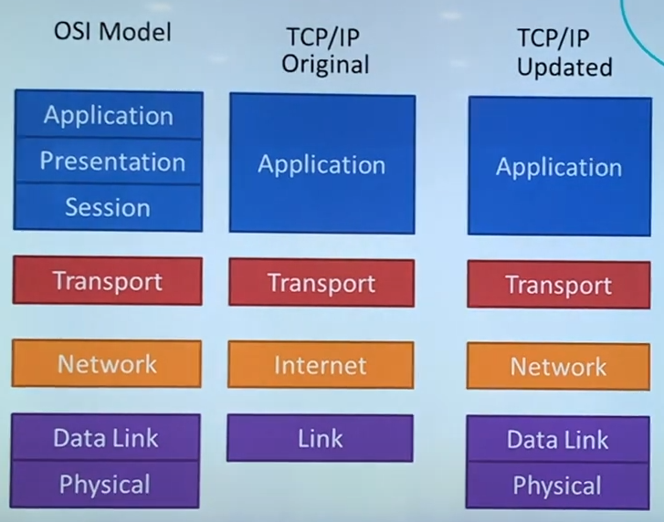

# OSI 7계층

- OSI는 국제표준화기구(ISO)에서 개발한 모델로, 컴퓨터 네트워크 프로토콜 디자인과 통신을 계층으로 나누어 설명한 것이다. 즉, 네트워크에서 통신이 일어나는 과정을 7단계로 나눈 것을 말한다.
- 계층을 나누는 이유는 통신이 일어나는 과정을 단계별로 알 수 있고, 특정한 곳에 이상이 생기면 그 단계만 수정할 수 있기 때문이다.
- https://www.youtube.com/watch?v=1pfTxp25MA8
- https://reakwon.tistory.com/59

### 1. 물리 계층(Physical Layer)

- 두 대의 컴퓨터가 통신하려면?
  - 모든 파일과 프로그램은 0과 1의 나열이다.
  - 결국 0과 1만 주고받을 수 있으면 된다.
- 그럼 두대의 컴퓨터를 전선 하나로 연결한다고 가정해봅시다.
  - 1을 보낼 때는 +5V의 전기를 전선으로 흘려보내고 0을 보낼 때는 -5V의 전기를 전선으로 흘려보내면 가능하다.
  - 0과 1을 주고받을 수 있으면 모든 데이터를 주고받을 수 있으므로 이제 두 컴퓨터는 모든 데이터를 주고받을 수 있게 되었다!

- 하지만 세상이 만만하지 않습니다. 이 간단한 아이디어는 실제에선 잘 동작하지 않습니다.
  - 일반전으로 전자기파를 전선을 통해 흘려보낼 때 제대로된 전자기파를 전송할 수 없습니다. 전자기파는 주파수가 뒤죽박죽이고 전선은 모든 주파수를 받을 수 있는게 아니라 특정 범위내에서만 받을 수 있다고 한다.
  - 수직선과 수평선이 있는 전자기파는 항상 0 ~ 무한대 [Hz]의 주파수 범위를 가진다고 합니다. 따라서 이런 전기신호를 통과시킬 수 있는 전선은 없다.

- 그럼 이 신호를 어떻게 전송해야 할 까?

- 이런식으로 아날로그 신호로 바꿔서 전송해야 합니다.
  - 0101 0101을 전송하고 싶으면 이것을 아날로그 신호로 변형하여 전선을 통해 보내고 다시 이 신호를 받하 복호화를 진행합니다.
- 그래서 결국 물리 계층이란?ㅜ 
  - 0과 1의 나열을 아날로그 신호로 바꾸어 전선으로 흘려 보내고(인코딩), 아날로그 신호가 들어오면 0과 1의 나열을 해석하여(디코딩) 물리적으로 연결된 두 대의 컴퓨터가 0과 1의 나열을 주고받을 수 있게 해주는 모듈
  - 즉 데이터는 0과 1의 비트열, 즉 전기적 신호 상태로 이루어져 있고 단지 데이터를 전달하기만 합니다.
  - 데이터 전송 단위 : 비트 스트림(Bit Stream)
  - 프로토콜 - RS-232, RS-449 등 케이블
  - 1계층 모듈은 하드웨어적으로 구현되어 있습니다. (PHY 칩)

### 2. 데이터 링크 계층(Data Link Layer)

- 데이터 링크 계층을 알기전에 여러 대의 컴퓨터 간의 통신하려면?

  - 다른 사람에게 데이터를 보낼 때마다 전선을 연결해야 한다. 너무 비효율적이고 비용이 증가합니다.
  - 따라서 전선 하나를 가지고 여러 대의 컴퓨터와 통신할 방법을 모색해야 합니다.
  - 그럼 이렇게 하면??
  - 
  - 구리선에 같은 데이터가 퍼지므로 하나의 전선으로 모두가 공유받을 수 있게 됩니다!

  - 

  - 이런식으로 더미허브를 이용해 구현할 수 있습니다.
  - 하지만 예림이가 혜림에게만 데이터를 보내려고 하는데 다른 컴퓨터도 볼 수가 있다는 문제점이 발생합니다.
  - 그럼 이 상자가 메시지의 목적지를 확인해서 혜림이게만 줄 수 있다면?
    - 이런 기능을 하도록 만든 것이 스위치라고 합니다.
  - 하나의 스위치로 연결된 것들을 네트워크나 인트라넷으로도 불립니다.
  - 그럼 만약에.. 다른 네트워크에서 통신을 하게 된다면?
  - 

  - 스위치를 연결해준다면 예림이가 혜림이한테 데이터를 보낼 수 있습니다. 이처럼 서로 다른 네트워크에 속한 컴퓨터끼리 통신이 가능하게 해주는 장비를 라우터라고 합니다. 근데 보통 스위치는 스위치 + 라우터를 모두 수행합니다 (L3스위치)
  - 초록색 기계는 공유기로 설명도 가능합니다.
  - 수많은 라우터들도 연결이 가능합니다. 이렇게 전 세계의 컴퓨터를 연결한 것이 인터넷 입니다.
  - 

  - 보통 해저 케이블을 통해 최상단에서 연결을 해주고 있습니다.

- 그럼 이제 데이터링크 계층이란 무엇인가?

  - 앞서 물리계층에서는 여러대의 컴퓨터가 통신할 수 없었습니다.
  - 그래서 다양한 기술을 통해 여러대가 통신할 수 있게 되었습니다.
  - 

  - 하지만 동시에 보내게 된다면 어떻게 제대로 끊어서 데이터를 잘 읽을 수 있을 까?
    - 이를 위해 송신자는 데이터의 앞 뒤에 특정한 비트열을 붙인다고 합니다.
    - 예를 들면 앞에는 111(시작)을 뒤에는 000(끝)을 붙인다고 하면 111메시지000
    - 여기서 111과 000을 찾아서 끊어 읽으면 됩니다! 이것을 통해 데이터를 구분합니다.
  - 그래서 결국 데이터 링크 계층은 같은 네트워크에 있는 여러 대의 컴퓨터들이 데이터를 주고 받기 위해서 필요한 모듈
    - 신뢰성있는 전송을 위해 오류 검출 및 회복을 위한 오류 제어 기능을 수행합니다. 또한 속도 차이 해결을 위해 흐름 제어기능도 수행한다고 합니다.
    - 데이터 전송단위 : 프레임(Frame)
    - 프로토콜 - Ethernet(이더넷), PPP, HDLC, ALOHA 등
  - Framing(111과 000으로 메세지를 감싸는 것들)은 Data-link Layer에 속하는 작업들 중 하나입니다.
  - 
  - 그럼 데이터 링크 계층 기술은 어디에 구현되어 있을까?
    - 랜카드
    - 2계층 모듈도 1계층 모듈처럼 하드웨어적으로 구현되어 있다!

### 3. 네트워크 계층(Network Layer)

- 이제는 A에서 B로 데이터를 보내고 싶습니다. 어떻게 해야 할까?
- A에서는 목적지의 주소(IP 주소)를 data앞에 붙입니다. (이것을 패킷이라고 합니다, 패킷은 구조체(객체)로 이루어져 있다.)
  - 여기서 A는 B의 IP주소를 알고 있어야 하는데 어떻게 알 수 있을까?
  - 우리가 주소창에 WWW.NAVER.COM을 입력하면 DNS를 통해 IP주소로 바뀌어서 사용됩니다. 따라서 우리는 NAVER의 IP주소를 이미 알고 있습니다!
  - 즉 결론적으로 상대방의 IP주소를 알고 있어야 데이터를 전송할 수 있습니다.

- A는 라우터 가에게 패킷을 전달합니다. 가는 이 패킷을 받아서 열어보고 목적지 IP주소를 확인합니다. 나랑 연결된 컴퓨터중에 IP주소 55.10.54.75인 컴퓨터가 없군! 하면서 데이터를 다시 포장한 다음 자신과 연결된 유일한 라우터 마에게 전달합니다. 패킷을 받은 라우터 마는 가의 라우터럼 목적지 주소를 읽고 목적지가 B라는 것을 알게된 마 라우터는 이제 패밋이 B에 도착하려면 어느 전선으로 패킷을 내보내야 하는지 알아내야 합니다. 우리는 딱보면 알지만 컴퓨터는 모른다... 그래서 이것을 라우터에서 특정한 기능을 통해 제공하고 있습니다. 이것은 따로 공부해보시길 추천..
- 그래서 마 라우터는 이미 B에게 데이터를 보내려면 바에게 데이터를 줘야한다는 것을 알고 있습니다. 라우터 마는 데이터를 다시 패킷으로 포장하여 바에게 넘겨줍니다. 라우터 바는 마가 했던 방법을 통해 라우터 라에게 다시 보냅니다! 마지막으로 라 라우터는 B에게 데이터를 줍니다!

- 그래서 결국 네트워크 계층 이란?
  - 수많은 네트워크의 연결로 이루어진 네트워크속에서 어딘가에 있는 목적지 컴퓨터로 데이터를 전송하기 위해 IP주소를 이용해 길을 찾고(Routing) 자신 다음의 라우터에 데이터를 넘겨주는 것(Forwarding)
  - 즉 상위 레벨 데이터를 패킷 안으로 캡슐화하여 데이터 종류에 상관없이 한 호스트에서 다른 호스트로 그 패킷들을 라우팅하는 것으로 데이터는 패킷 안으로 캡슐화되며, 패킷 헤더는 패킷의 송신지와 수신지 주소들을 포함하는 필드를 가집니다.
  - 해당 경로에 따라 패킷을 전달. 라우팅, 흐름제어, 오류제어, 세그먼테이션 등을 수행한다고 합니다.

- 네트워크 계층 기술은 어디에 구현되어 있을까?
  - 운영체제의 커널에 소프트웨어적으로 구현되어 있습니다.
- 데이터 전송 단위 : 패킷
- 프로토콜 - IP, RIP, ARP, ICMP

### 4. 전송계층(Transport Layer)

- 이제 인터넷 상의 모든 컴퓨터가 서로 통신할 수 있게 되었습니다. 즉 전 세계의 컴퓨터로부터 수신자는 데이터를 받을 것입니다.
- 데이터를 받은 컴퓨터는 여러개의 프로그램이 실행되고 있습니다.(여러개의 프로세스)
- 컴퓨터는 여러가지의 데이터를 프로세스들에게 나누어 주려고 합니다. 어떤 데이터를 무슨 프로세스에게 줘야할지 어떻게 알 수 있을까?
  - 먼저 데이터를 받고자 하는 프로세스들은 포트 번호라는 것을 가져야 합니다. 포트 번호는 하나의 컴퓨터에서 동시에 실행되고 있는 프로세스들이 서로 겹치지 않게 가져야하는 정수 값입니다.
  - 그래서 송신자는 데이터를 보낼 때 데이터를 받을 수신자 컴퓨터에 있는 프로세스의 포트 번호를 붙여서 보냅니다.
    - 그러면 데이터 전송자는 포트번호를 미리 알고 있어야 한다는 의미입니다. naver.com도 naver.com:80으로 80이 생략된 것입니다. 즉 우리는 네이버의 포트번호를 알고잇는 셈이죠.

- 그래서 결국 전송계층이란?
  - 포트 번호를 사용해서 도착지 컴퓨터의 최종 도착지인 프로세스에 까지 데이터가 도달하게 하는 모듈입니다.
  - TCP와 UDP 프로토콜을 통해 통신을 활성화한다. 
    - TCP : 신뢰성, 연결지향적
    - UDP : 비신뢰성, 비연결성, 실시간
  - 어렵게 풀자면 헤더에 송수신지 포트번호를 포함하여 올바르게 전달 될 수 있게 하는 계층으로 전체 메시지를 종단 대 종단간 제어와 에러를 관리합니다. 또한 패킷의 전송이 유효한지 확인, 전송에 실패된 패킷을 재전송 하는 등 신뢰성 있는 통신을 보장합니다. (주소 설정, 오류 제어, 흐름제어, 다중화 수행)

- 그럼 전송계층은 어디에 구현되어 있을까?
  - 운영체제의 커널에 소프트웨어적으로 구현되어 있습니다.
- 데이터 전송 단위: 세그먼트(segment)
- 프로토콜 - TCP, UDP

### 5. 응용 계층(Application  Layer)

- 세션계층과 표현계층을 건너 뛴 이유

  - 현대의 인터넷은 OSI 모델이 아니라 TCP/IP 모델을 따르고 있습니다.
  - TCP/IP 모델도 OSI 모델과 마찬가지로 네트워크 시스템에 대한 모델입니다.
  - 현대의 인터넷이 TCP/IP 모델을 따르는 이유는 OSI 모델이 TCP/IP 모델과의 시장 점유율 싸움에셔 졌기 때문이죠.
  - 

  - 이름이 틀린 이유는 TCP/IP이 업데이트 되면서 조금 바뀌었다고 합니다.
  - 즉 TCP/IP는 업데이트 되면서 1~4계층은 OSI모델과 똑같아지고 위에는 응용 계층만 남기게 됩니다.

  - 

- TCP/IP 소켓 프로그래밍
  - 운영체제의 전송계층에서 제공하는 API를 활용해서 통신 가능한 프로그램을 만드는 것을 TCP/IP 소켓 프로그래밍 또는 네트워크 프로그래밍이라고 합니다.
  - 즉 소켓 프로그래밍 만으로도 클라이언트, 서버 프로그램을 따로따로 만들어서 동작시킬 수 있습니다.
  - 또한 TCP/IP 소켓 프로그래밍을 통해서 누구나 자신만의 응용 계층 인코더와 디코더를 만들 수 있습니다.
    - 이게 무슨 의미냐면 누구든 자신만의 응용 계층 프로토콜을 만들어서 사용할 수 있다는 의미입니다.
- 대표적인 응용 계층의 프로토콜인 HTTP로 인코딩과 디코딩 과정을 살펴봅시다.

- 서버에서 뭐해라는 데이터를 내려줍니다. http 인코더를 통과하면서 Status code : 500이 붙어서 4계층에 전달합니다.
- 4계층에서는 포트번호를 붙여서 내려주면 아날로그 신호로 변형되어 데이터가 도착하게 되고 디코더를 통해 다시 해석이 됩니다.
- 이 데이터는 4계층과 5계층을 통해 뭐해라는 데이터를 꺼낼 수 있게 됩니다.

- 그럼 왜 이 계층을 사용하는 것일까?

  - 만약 서버에서 클라이언트로 데이터를 보낼때 타입이 다앙하다면?
  - 이미지, 텍스트 등...
  - 클라이언트는 이미지 데이터를 받았다면 이미지파일로 해석해야합니다. 텍스트는 UTF-8로 해석해야 겠죠..
  - 이를 가능하기 위해서 서버에서 데이터 앞에 dataType:text 이런식으로 헤더에 붙여서 보내게 됩니다. 그럼 클라이언트는 이 부분을 읽어서 데이터를 올바른 방식으로 해석할 수 있습니다.
  - 그래서 보통 직접 개발하기보다는 응용 계층의 프로토콜을 가져다가 사용하고 있습니다. (HTTP)

- 데이터 전송 단위 : 메시지(message)

- 프로토콜 : HTTP, FTP, DNS, SMTP

- 어렵게 설명하자면 컴퓨터 네트워크 프로그래밍에서 인터넷 프로토콜(IP) 컴퓨터 네트워크를 통하는 프로세스 간 통신 접속을 위해 설계되어 통신 프로토콜과 방식을 위해 보유된 추상 계층이다. 응용 계층 프로토콜은 기반이 되는 전송 계층 프로토콜을 사용하여 호스트 간 연결을 확립하고 응용 프로세스와 직접 관계하여 일반적인 응용 서비스를 수행합니다.

  ( 응용 프로세스 간의 정보 교환, 전자 메일, 파일 전송 등의 서비스를 제공 )

  

## 예외) 세션 계층(5계층)과 표현(6계층) 계층

### 세션 계층(Session Layer)

- 양 끝단의 응용 프로세스가 통신을 관리하기 위한 방법을 제공합니다.

- 통신을 하기 위한 세션 확립/유지/중단 (운영체제가 해줌)
- **데이터가 통신하기 위한 논리적인 연결**임, 통신하는 사용자들을 동기화하고 오류복구 명령들을 일괄적으로 다룬다
- 동시 송수신 방식(duplex), 반 이중 방식(half-duplex), 전이중 방식(full duplex)의 통신과 함께 체크 포인팅과 유휴, 종료, 다시 시작 과정 등을 수행

- 데이터 전송 단위 : 메시지(message)
- 프로토콜 : NetBIOS, SSH

### 표현 계층(Presentation Layer)

- 응용 계층으로부터 받은 데이터를 하위 계층인 세션 계층에 보내기 전 통신에 적당한 형태로 변환합니다.

- 세션 계층에서 받은 데이터는 응용 계층에 맞게 변환하는 역할을 수행합니다.

- 코드 변환, 구문 검색, 데이터 압축 및 암호화 등의 기능 수행합니다.
- 즉 코드 간의 번역을 담당하여 사용자 시스템에서 데이터 형식상 차이를 다루는 부담을 응용 계층으로부터 덜어준다.
- 데이터 표현에 대한 독립성을 제공, 암호화
- 파일 인코딩, 명령어를 포장, 압축, 암호화

- 데이터 전송 단위 : 메시지(message)

- 프로토콜 : JPG, MPEG, AFP, PAP

