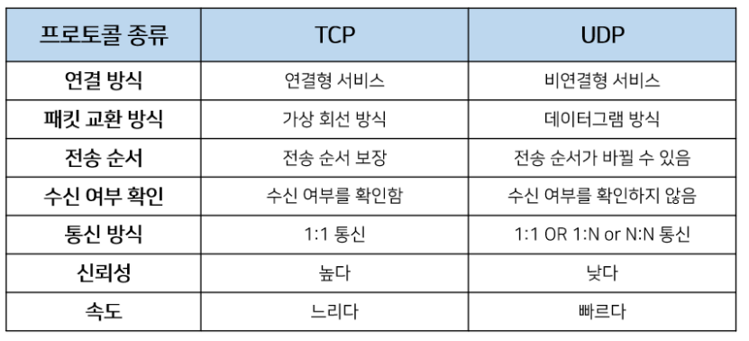

# TCP와 UDP의 특징과 차이

### 1. TCP(Transmission Control Protocol)

- 인터넷상에서 데이터를 메세지의 형태로 보내기 위해 IP와 함께 사용하는 프로토콜
- 일반적으로 TCP와 IP를 함께 사용하는데, IP가 데이터의 배달을 처리한다면 TCP는 **패킷을 추적 및 관리**하게 됩니다. 

### 특징

- 연결형 서비스로 가상 회선 방식을 제공
- 3-way handshaking과정을 통해 연결을 설정하고 4-way handshaking을 통해 해제한다.
  - 4-way handshaking
    - 클라이언트가 연결을 종료하겠다는 FIN플래그를 전송한다.
    - 서버는 일단 확인메시지를 보내고(**ACK**) 자신의 통신이 끝날때까지 기다리는데 이 상태가 **TIME_WAIT**상태다.
      - Server에서 FIN을 전송하기 전에 전송한 패킷이 Routing 지연이나 패킷 유실로 인한 재전송 등으로 인해 FIN패킷보다 늦게 도착하는 상황을 방지하기 위해 (디폴트 240초)동안 패킷을 기다리는 과정이 **TIME_WAIT** 입니다.
    - 서버가 통신이 끝났으면 연결이 종료되었다고 클라이언트에게 FIN플래그를 전송한다.
    - 클라이언트는 확인했다는 메시지를 보낸다. **(ACK**)
- 흐름 제어 및 혼잡 제어
- 높은 신뢰성을 보장
- UDP보다 속도가 느림
- 전이중(Full-Duplex), 점대점(Point to Point) 방식.

### TCP 서버 특징

- 서버소켓은 연결만을 담당한다.
- 연결과정에서 반환된 클라이언트 소켓은 데이터의 송수신에 사용된다형 서비스로 가상 회선 방식을 제공한다.
- 서버와 클라이언트는 1대1로 연결된다.
- 스트림 전송으로 전송 데이터의 크기가 무제한이다.
- 패킷에 대한 응답을 해야하기 때문에(시간 지연, CPU 소모) 성능이 낮다.
  - 패킷 : 인터넷 내에서 데이터를 보내기 위한 경로배정(라우팅)을 효율적으로 하기 위해서 데이터를 여러 개의 조각들로 나누어 전송을 하는데 이때, 이 조각을 패킷이라고 합니다.
- Streaming 서비스에 불리하다.(손실된 경우 재전송 요청을 하므로)
- A,B,C라는 패킷에 1,2,3이라는 번호를 부여하여 패킷의 분실 확인과 같은 처리를 하여 목적지에서 재조립을 합니다. 이런 방식으로 TCP는 패킷을 추적하며, 나누어 보내진 데이터를 받고 조립을 할 수 있습니다.

### 2. UDP(**User Datagram Protocol**)

- 데이터를 데이터그램 단위로 처리하는 프로토콜
- 연결을 위해 할당되는 논리적인 경로가 없는데, 그렇기 때문에 각각의 패킷은 다른 경로로 전송되고, 각각의 패킷은 독립적인 관계를 지니게 됩니다.
- UDP는 비연결형 서비스이기 때문에, 연결을 설정하고 해제하는 과정이 존재하지 않습니다. 
- 서로 다른 경로로 독립적으로 처리함에도 패킷에 순서를 부여하여 재조립을 하거나 흐름 제어 또는 혼잡 제어와 같은 기능도 처리하지 않기에 TCP보다 속도가 빠르며 네트워크 부하가 적다는 장점이 있지만 신뢰성있는 데이터의 전송을 보장하지는 못합니다. 
- 신뢰성보다는 연속성이 중요한 서비스 예를 들면 실시간 서비스(streaming)에 자주 사용됩니다.

### 특징

- 비연결형 서비스로 데이터그램 방식을 제공한다.
- 정보를 주고 받을 때 정보를 보내거나 받는다는 신호절차를 거치지 않는다.
- UDP헤더의 CheckSum 필드를 통해 최소한의 오류만 검출한다.
- 신뢰성이 낮다
- TCP보다 속도가 빠르다

### UDP 서버의 특징

- UDP에는 연결 자체가 없어서(connect 함수 불필요) 서버 소켓과 클라이언트 소켓의 구분이 없다.
- 소켓 대신 IP를 기반으로 데이터를 전송한다.
- 서버와 클라이언트는 1대1, 1대N, N대M 등으로 연결될 수 있다.
- 데이터그램(메세지) 단위로 전송되며 그 크기는 65535바이트로, 크기가 초과하면 잘라서 보낸다.
- 흐름제어(flow control)가 없어서 패킷이 제대로 전송되었는지, 오류가 없는지 확인할 수 없다.
- 파일 전송과 같은 신뢰성이 필요한 서비스보다 성능이 중요시 되는 경우에 사용된다.

### 흐름제어, 혼잡제어란

- 흐름제어는 데이터를 송신하는 곳과 수신하는 곳의 데이터 처리 속도를 조절하여 수신자의 버퍼 오버플로우를 방지하는 것입니다. 예를 들어 송신하는 곳에서 감당이 안되게 데이터를 빠르게 많이 보내면 수신자에서 문제가 발생하기 때문입니다.
- 혼잡제어는 네트워크 내의 패킷 수가 넘치게 증가하지 않도록 방지하는 것입니다. 만약 정보의 소통량이 과다하면 패킷을 조금만 전송하여 혼잡 붕괴 현상이 일어나는 것을 막습니다.

### 참고

- https://mangkyu.tistory.com/15

- https://mindnet.tistory.com/entry/%EB%84%A4%ED%8A%B8%EC%9B%8C%ED%81%AC-%EC%89%BD%EA%B2%8C-%EC%9D%B4%ED%95%B4%ED%95%98%EA%B8%B0-22%ED%8E%B8-TCP-3-WayHandshake-4-WayHandshake