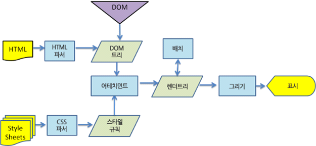

# 브라우저 동작방식

### 1. 브라우저의 주요 기능

- 사용자가 선택한 자원을 서버에 요청하고 브라우저에 표현하는 것이다.

- 자원은 보통 HTML 문저지만 PDF나 이미지 등 다양한 형태로 오기도 한다.

- 자원의 주소는 URI

  - URI(Uniform Resource Identifier) 안에 URL(Locator)과 URN(name) 이 있다.
  - URL : 인터넷 상의 자원 위치를 나타낸다. 즉 웹 상에서 서비스를 제공하는 각 서버들에 있는 파일의 위치를 표기 한 것 ( http://blong.com/work/test.pdf  )
  - URI : 인터넷 상의 자원을 식별하기 위한 문자열로 구성,
    - 통합 자원 식별자
    - http://test.com/test.pdf?docid=111  => URI는 맞지만 URL은 아니다.
    - 쿼리 스트링의 값에 따라 결과가 달라지게 된다. 식별자의 역할을 하는 것

  - URN : 해당 리소스 위치정보가 아닌 실제 리소스의 이름을 사용하는 빙식
    - 콘텐츠를 이루는 한 리소스에 대해 그 리소스 위치에 영향을 받지 않는 이름 역할을 한다.
    - 리소스를 여기저기 옮겨도 문제없이 작동한다.
    - urn : isbn : 9788982814471

- HTML과 CSS 명세에 따라 HTML파일을 해석해서 표시해준다. (W3C의 표준에 의해서)

### 2. 브라우저의 기본 구조

- 사용자 인터페이스 : 주소표시줄, 이전/다음 버튼, 북마크 메뉴 등 요청한 페이지 보여주는 창을 제외한 나머지
- 브라우저 엔진 : 사용자 인터페이스와 렌더링 엔진사이의 동작을 제어

- 렌더링 엔진 : 요청한 콘텐츠를 표시, ex) html을 요청하면 html과 css를 파싱하여 화면에 표시
  - 통신 : HTTP 요청과 같은 네트워크 호출시 사용된다. 플랫폼 독립적인 인터페이스
  - UI 백엔드 : 콤보 박스와 창 같은 기본적인 장치를 그린다, OS 사용자 인터페이스 체계를 사용
  - 자바스크립트 해석기 : 자바스크립트 코드를 해석하고 실행
- 자료 저장소 : 쿠키 등 모든 종류의 자원을 하드 디스크에 저장한다.

=> 각 탭은 독립적인 프로세스로 처리된다.

### 2-1 렌더링 엔진

- 요청 받은 내용을 브라우저 화면에 표시한다.
- 파이어폭스 : 게코 엔진을 사용한다.
- 사파리와 크롬 : 웹킷 엔진을 사용한다.
  - 웹킷 : 최초 리눅스 플랫폼에서 동작하기 위해 제작된 오픈소스
- 동작과정

- HTML 문서를 파싱하고 콘텐츠 트리 내부에서 태그를 DOM 노드로 변환.
- 다음 외부 CSS파일과 함께 포함된 스타일 요소도 파싱
- 이를 바탕으로 스타일정보와 HTML 표시규칙인 **렌더트리**라고 부르는 트리 생성
- 렌더트리 생성이 끝나면 배치가 시작된다.
- 다음에 UI 백엔드에서 렌더 트리의 각노드를 가로지르며 형상을 만들어 내는 그리기 과정
  - 속도를 위해 HTML을 파싱할 때까지 기다리지 않고 배치와 그리기 과정 실행
  - 아래는 웹킷 예시

- 어태치먼트 : 렌더 트리 생성을 위해 DOM 노드와 시각 정보를 연결하는 과정

## 면접질문

### 1. 사용자가 URL에 주소를 입력시 무슨 현상들이 발생하나요?

- 첫번째로 웹브라우저에 URL를 입력하면 브라우저가 URL을 분석하기 시작합니다.
  - URL 구조가 맞지 않다면 사용중인 웹 브라우저의 검색엔진으로 검색이 실행된다.
  - 구조가 맞다면 HTTPS / HTTP 로 첫 요청을 보냅니다.
- DNS에 내가 접근하려는 name 주소의 ip를 요청 합니다.
  - 처음에는 자신이 사용하고 있는 인터넷의 통신사의 DNS서버애서 캐시를 먼저 확인한다.
  - 캐시에 있으면 그 IP주소를 리턴하고 없으면 DNS의 서버로 부터 요청한다.
    - Root server - Top-level server - Authoriative server를 거치면서 ip주소를 받아옵니다.
- IP주소를 받은 다음 ARP를 통해 실질적으로 내가 접근해야할 IP주소를 할당받은 녀석의 MAC 주소를 추적
  - subnet인지 아닌지 판단하고 router 내에 존재할 경우(local network), routing table을 추적하여 MAC 주소를 알아낸다.
  - local Network가 아닐 경우, gateway를 타고 밖으로 나가 상대방의 MAC 주소를 찾는다.
    - 이 과정에서 ARB를 Broadcasting 한다.
  - 상대방의 ip와 mac 주소를 응답 받으면 다시 DNS 프로세스를 시작한다. DNS에서 53번 포트를 통해 UDP로 통신을 실시하며 데이터 용량이 큰 경우 TCP로 진행
- 대상과 TCP 통신을 통해 Soket을 연다.
  - 브라우저가 대상 서버의 ip주소를 받으면 url에서 포트번호(HTTP의 기본값 80, HTTPS 기본값 443)를 가져와서 TCP Soket 연결을 요청한다.
  - OSI 7계층을 통해 클라이언트에서 서버까지 데이터 전달 및 세션 연결
  - 이때 OSI(4계층)에서 Session을 연결할 때 TCP 연결 진행
- HTTPS 일경우 TLS(Seucure Sokets Layer) 과정 추가
- HTTP 프로토콜 요청이 이루어진다
  - 클라이언트가 서버에 HTTP 프로토콜을 요청한다.
  - 형식 : Request => GET / HTTP/1.1 host: google.com .....
- HTTP의 응답이 이루어 진다
  - 형식 : Response
- 웹 브라우저에 그림을 그린다!
  - HTML, CSS, JS 구문을 분석 + 렌더링 ( DOM Tree 구성 - 렌더 트리 구성 - 렌더트리 레이아웃 배치 - 렌더트리 그리기 )

# 용어 정리

- ARP
  - 주소 결정 프로토콜
  - 네트워크 상에서 IP주소를 물리적 네트워크 주소로 대응 시키기 위해 사용되는 프로토콜
  - TCP/IP 3계층(네트워크 계층)의 IP adress를 2계층(데이터링크계층)의 mac address로 대응시킬 때 사용하는 프로토콜 이다.
  - 즉 최종적으로 목적지에 데이터를 보낼 곳의 주소를 확인하는 프로토콜
    - ex) 우리는 102호 몇년생 홍길동은 알지만 어느지역 어느 아파트인지 무슨동인지 모르는 상황
    - 120호 몇년생 홍길동 이신분? 나머지 집주소좀 알려주세요!!

- 브로드 캐스트 방식 : 로컬 랜상에 붙어있는 모든 네트워크 장비들에게 보내는 통신이다.
  - 이 IP주소를 가진 컴퓨터 누구야? 라고 브로드 캐스트가 보내면 그 IP주소를 가진 컴퓨터가 나야!라고 답을 보내면서 주소도 같이보낸다.
- 반대로 MAC 주소는 알지만 목적지 IP를 모를때 RARP 프로토콜을 사용!

- 라우터와 게이트웨이
  - 라우터(Router)
    - 서로 다른 네트워크 (ip의 class나 subnetting이 틀린 경우) LAN과 WAN을 연결하는 등 서로 다른 media type을 연결하때 사용
    - osi 7계층에서 3계층 동작 (Routing protocall) 사용, IP Packet이 원하는 목적지까지 원할하게 갈 수 있도록 경로를 정해주는 역할을 하는 장비
    - 라우팅 테이블 : 최적 라우팅 정보를 모두 나타낸 표 테이블

 

- 게이트웨이(Gateway)
  - 게이트웨이는 다른 네트워크로 들어가는 입구 역할을 하는 네트워크 포인트이다. 
  - 네트워크 주소가 다른 네트워크를 연결할때 반드시 거쳐가는 것

- LAN 과 WAN
  - LAN(Local Area Network) : 사용자가 포함된 지역 네트워크
    - 학교, 회사, 집에서 컴퓨터, ip전화기 장비 들이 서로 연결한 것.
    - 공유기나 스위치등을 이용해 연결
    - 이더넷 프로토콜을 주로 사용
  - WAN(Wide Area Network) : LAN과 LAN 사이를 광범위한 지역 단위로 구성하는 네트워크
    - 집에서 보통 ISP(internet service provider => kt, lg, skt) 네트워크 망을 접속한다.
    - 내 컴퓨터에서 ISP업체에서 설치해준 랜선을 통해 밖으로 나가서 웹서버에 가서 접속