# 인터넷 네트워크

### 1. 인터넷 통신

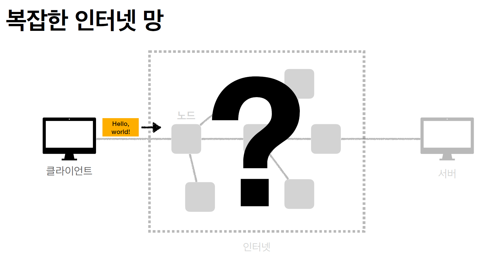

### 2. IP( 인터넷 프로토콜 )

- 지정한 IP 주소(IP Address)에 데이터를 전달합니다.
- 패킷(Packet)이라는 통신 단위로 데이터를 전달합니다.
  - IP 패킷 정보 : 출발지 IP, 목적지 IP, 기타... + 전송데이터

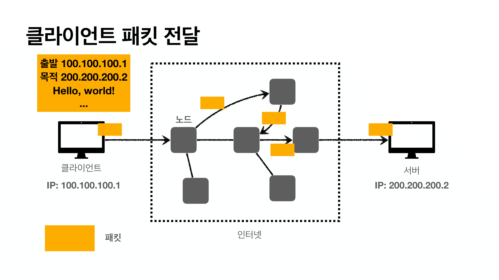

- IP 패킷을 서버에 던집니다. 
- 적절하게 노드들끼리 목적지까지 도착할 수 있도록 던집니다.

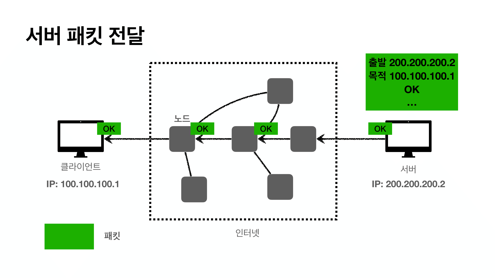

- 하지만 IP 프로토콜만 사용하기에는 한계가 있습니다.
  - 비연결성 : 패킷을 받을 대상이 없거나 서비스 불능 상태여도 패킷이 전송됩니다.
  - 비신뢰성 : 중간에 패킷이 사라진다면 ?, 패킷이 순선대로 오지 않으면 ?
  - 프로그램 구분 : 같은 IP를 사용하는 서버에서 통신하는 애플리케이션이 둘 이상이면?
- 이 문제를 해결해주는 것이 **TCP 프로토콜** 입니다.

### 3. TCP 프로토콜

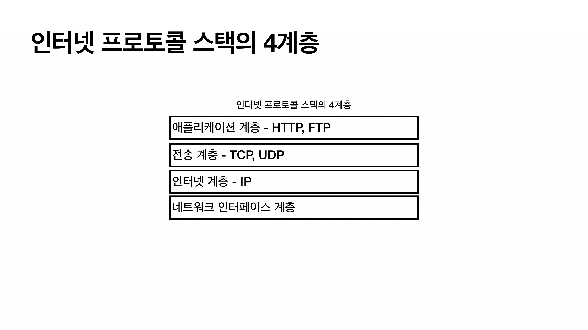

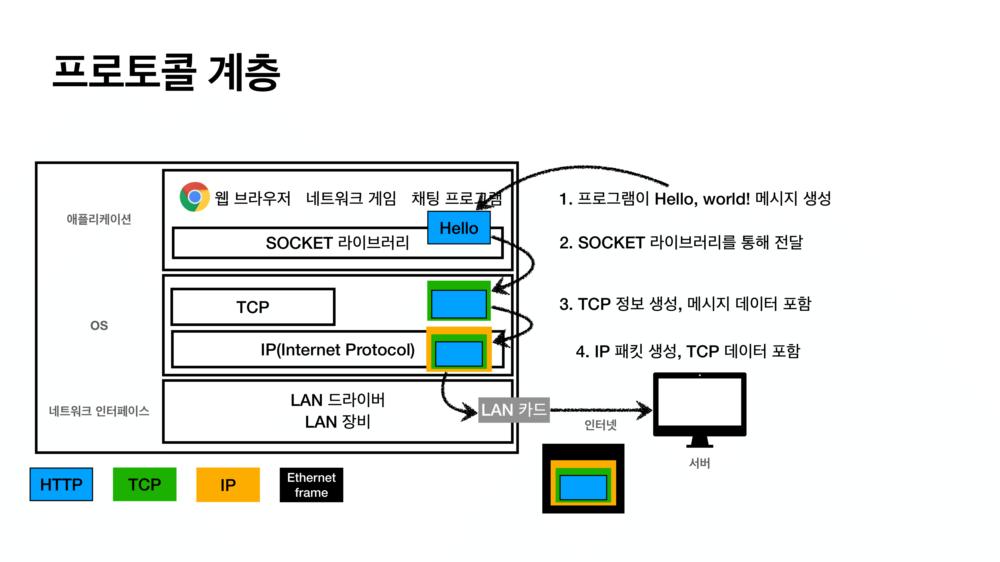

- IP 패킷 안에 TCP/IP 패킷 정보가 들어가게 됩니다.

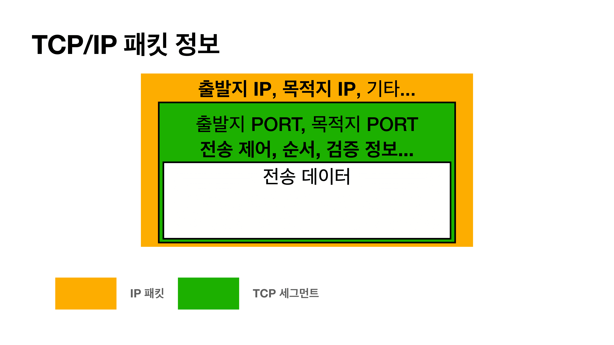

- TCP 특징
  - 전송 제어 프로토콜(Transmission Control Protocol)
  - 연결 지향 - TCP 3 way hanshake ( 가상연결 )
    - 연결이 되야먄 데이터를 보냅니다.
  - 데이터 전달 보증 : TCP는 데이터를 전송하면 서버에서 데이터를 잘 받았다고 메세지를 보내줍니다.
  - 순서 보장
    - 패킷1, 패킷2, 패킷3 순서로 전송 => 서버슨 패킷1, 패킷3, 패킷2 순서로 도착
    - 기본적으로 서버가 클라이언트에게 패킷 2부터 다시 보내라고 요청합니다.
    - 내부적으로 서버가 스스로 최적화할 수는 있습니다. ( 알아서 순서 맞추기 )
  - 신뢰할 수 있는 프로토콜
  - 현재는 대부분 TCP를 사용합니다.

- TCP 3 way handshake

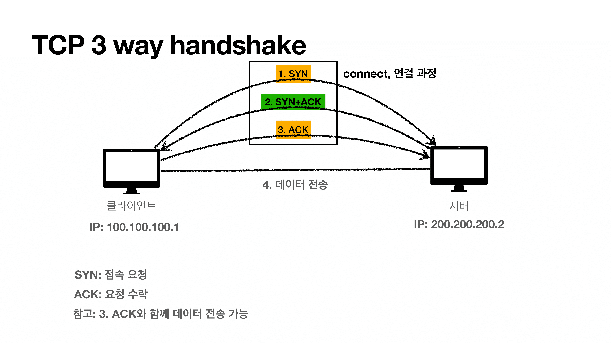

- 직접 물리적으로 연결되는 것이 아니고 그냥 ACK를 둘다 받았으니 연결되었다고 가상으로 또는 **논리적**으로 연결된 것입니다.

- 그럼 UDP는 무엇인가
  - TCP는 다 좋지만 여러가지 기능때문에 시간이 좀 걸리게 됩니다.
  - UDP는 기능이 많이 없기 때문에 직접 애플리케이션에서 직접 추가작업(기능확장)을 해서 사용할 수 있습니다.
  - 최근에는 HTTP 통신할 때 HTTP 3이 나오면서 UDP가 뜨고 있습니다.(더 최적화)

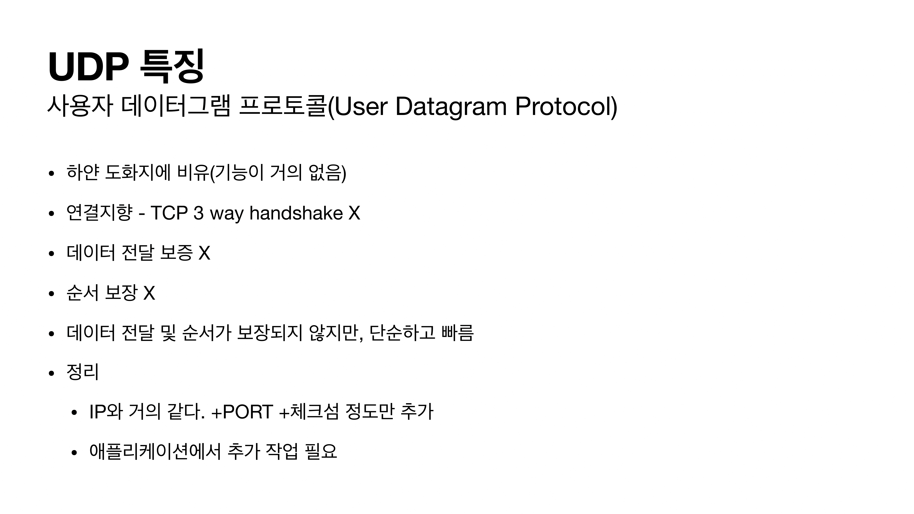

### 4. PORT

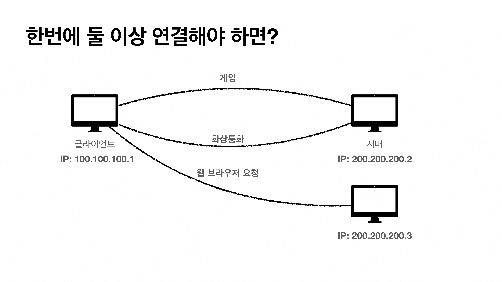

- 무슨 어플리케이션에서 필요한 패킷인지 구분하기 위해 포트를 사용합니다.
  - 모두 IP 주소는 동일합니다. ( 목적지 서버를 찾을 때 IP 사용 )
  - 패킷에 **IP주소**(출발지, 목적지), **포트번호**(출발지, 목적지), **전송 데이터**가 들어있습니다.
  - IP는 아파트, 포트번호는 몇동 몇호

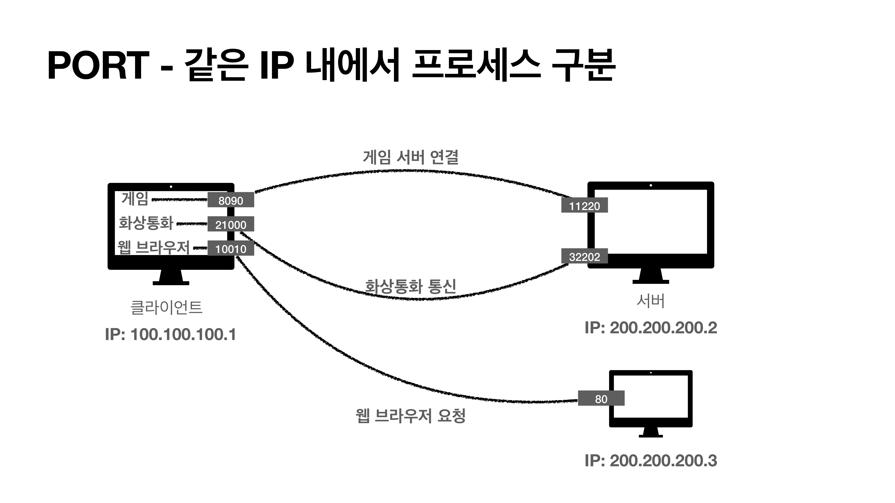

- 포트번호는 0 ~ 65535 할당 가능합니다.
- 0 ~ 1023 : 잘 알려진 포트로서 사용하지 않는 것이 좋습니다.
  - FTP : 20, 21
  - TELNET : 23
  - HTTP : 80
  - HTTPS : 443

### 5. DNS ( Domain Name System)

- IP는 너무 기억하기 어려운 문제가 있었습니다. 또한 IP가 변경되는 일이 자주 있었습니다.
- 도메인 명과 IP주소를 등록하고 도메인 명을 사용할 때 IP주소로 바꿔주는 전화번호부 역할을 합니다.
- DNS를 사용하면 두가지 문제점을 해결할 수 있게 됩니다.

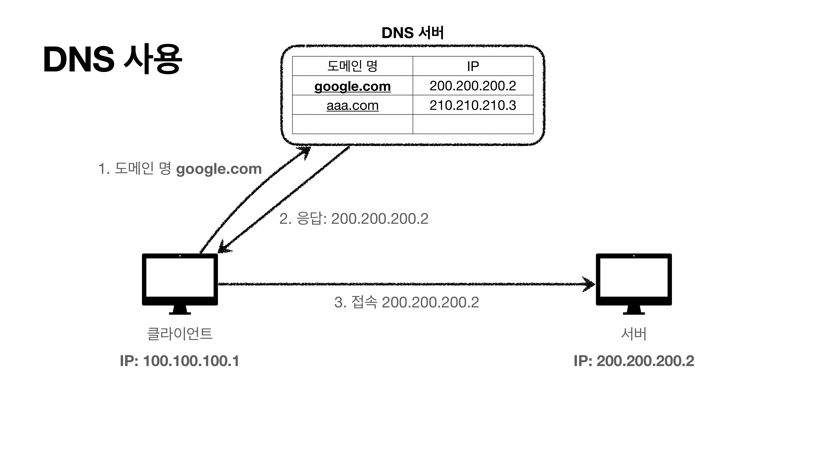