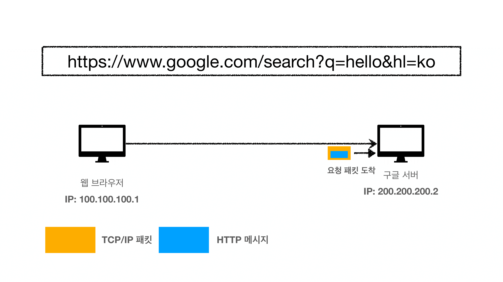

# URI와 웹브라우저 요청 흐름

### 1. URI(Uniform Resource Identifier)

- 로케이터(locator), 이름(name) 또는 둘 다 추가로 분류될 수 있다.
- Uniform : 리소스 식별하는 통일된 방식
- Resource : 자원, URI로 식별할 수 있는 모든 것(제한 없음)
- Identifier : 다른 항목과 구분하는데 필요한 정보

- URL : 리소스가 있는 위치를 지정 ( 거의 이것만 사용 )
- URN : 리소스에 이름을 부여
- 위치는 변할 수 있지만 이름은 변하지 않습니다.
  - urn:isbn:8960777331 ( 어떤 책의 isbn URN )
  - URN 이름만으로 실제 리소르를 찾을 수 있는 방법이 보편화 되지 않음
- 결국 **URI**를 **URL**과 같은 의믜로 이야기해도 무방!

### URL 분석 및 전체 문법

- scheme
  - 주로 프로토콜에서 사용
  - 프로토콜 : 어떤 방식으로 자원에 접근할 것인가 하는 약속과 규칙
    - http, https, ftp 등
  - http는 80 포트, https는 443 포트를 주로 사용, 포트는 생략 가능!
  - https는 http에 강력한 보안 추가(HTTP Secure)
- userinfo
  - URL에 사용자정보를 포함해서 인증해야 할 때 사용
  - 거의 사용하지 않습니다.
- host
  - 호스트명
  - 도메인명 또는 IP 주소를 직접 사용 가능
- PORT
  - 포트(PORT)
  - 접속 포트
  - 일반적으로 생략, 생략시 http는 80, https는 443
- path
- 리소스가 있는 경로, 계층적 구조
  - /home/file1.jpg
  - /members
  - /members/100, /items/iphone12
- query
  - key=value 형태
  - `?`로 시작, `&`로 추가 가능 ?keyA=valueA&keyB=valueB
  - query parameter, query string 등으로 불립니다. 웹서버에 제공하는 파라미터
    - 숫자로 적어도 문자열 형태로 넘어갑니다.
- fragment
  - html 내부 북마크 등에 사용
    - html 내부에서 중간으로 이동하고 싶을 때
  - 서버에 전송하는 정보 아님

### 2. 웹 브라우저 요청 흐름

- 구글버서는 요청패킷이 도착하면 **TCP/IP 패킷**을 다 까서 버리고 **HTTP 메시지**를 뽑아내서 해석합니다.

- 구글 서버에서 응답 메시지를 만듭니다.
- `Content-Type` : 응답하는 데이터 형식
- `Content-Length` : 실제 html 데이터의 길이

- 웹브라우저가 HTML을 렌더링 합니다.

- 흐름 정리하기
  - resource 요청 시, 웹 브라우저가 HTTP 메시지 생성
  - SOCKET 라이브러리를 통해 TCP/IP로 3way handshake를 실행해 서버와 연결한다.
  - 운영체제 TCP/IP 계층으로 데이터 전송을 하기 위해 데이터를 전달한다.
  -  HTTP 메시지가 포함된 TCP/IP 패킷을 생성한다.
  - 패킷 정보가 인터넷으로 흘러간다.
  - 서버에 요청 패킷이 도착하여 패킷 껍데기는 버리고 HTTP 메시지를 서버가 해석한다.
  -  HTTP 응답 메시지를 마찬가지 방식으로 패킷을 생성하여 응답 패킷을 전달한다.
  - 수 많은 노드들을 통해서 응답 패킷이 도착하게 되면 웹 브라우저가 HTML 렌더링하여 화면에 보여준다.