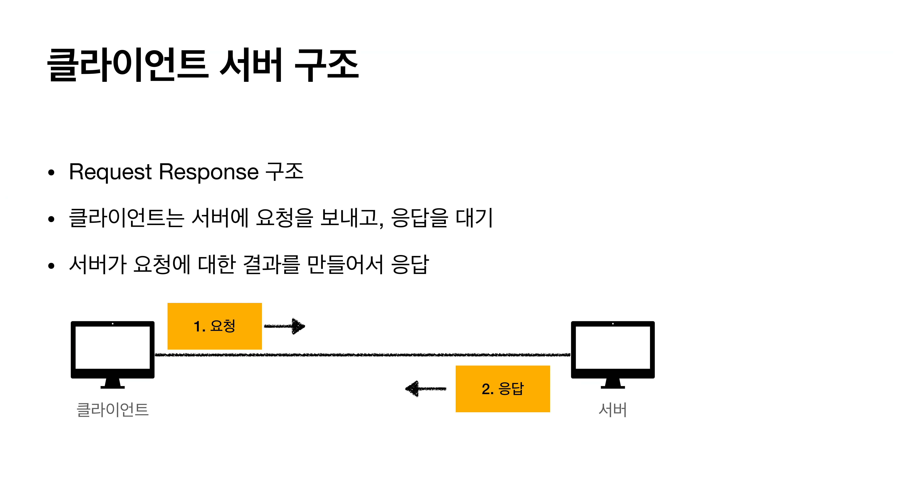

# HTTP 기본

### 1. 모든 것이 HTTP

- HyperText Transfer Protocol
- 지금은 모든 것을 **HTTP**에 담아서 전송합니다.
  - HTML, TEXT
  - IMAGE, 음성, 영상
  - JSON, XML(API)
  - 거의 모든 형태의 데이터 전송 가능
  - 서버간에 데이터를 주고 받을 때도 대부분 HTTP 사용
- HTTP 역사
  - HTTP/0.9 1991년: GET 메서드만 지원, HTTP 헤더(X)
  - HTTP/1.0 1996년: 메서드, 헤더 추가
  - **HTTP/1.1 1997년: 가장 많이 사용, 우리에게 가장 중요한 버전**
    - RFC2068(1997) => RCF2616(1999) => RFC7230~7235(2014)
  - HTTP/2 2015: 성능개선
  - HTTP/3 진행중: TCP 대신에 UDP 사용, 성능 개선
- 기반 프로토콜
  - TCP :  HTTP/1.1, HTTP/2
  - UDP : HTTP/3 ( TCP에서 활용하는 기술 복잡도를 줄이기 위해 성능 개선해 나온 것이 HTTP/3 )
  - 현재 HTTP/1.1 주로 사용, HTTP/2, HTTP/3도 점점 증가
  - 브라우저 관리도구에서 확인 가능 ( 구글은 2, 3, 네이버는 1, 2 주로 사용)
- HTTP의 특징
  - 클라이언트 서버 구조
  - 무상태 프로토콜(스테이스리스), 비연결성
  - HTTP 메시지
  - 단순함, 확장 가능


### 2. 클라이언트 서버 구조



- 비즈니스로직, 데이터는 서버에! 
- UI, 사용성 등은 클라이언트에!
- 이렇게 하면 **클라이언트**와 **서버**는 독립적으로 각각 진화할 수 있습니다.
  - 트래픽이 폭주하면 서버만 손보면 된다는 의미! ( 언어를 바꾸거나 서버를 바꾸거나 인프라 구성 등 )


### 3. 무상태 프로토콜 (스테이스리스:Stateless)

- 서버가 클라이언트의 상태를 보존하지 않습니다.
- 장점 : 서버 확장성 높음(스케일 아웃)
- 단점 : 클라이언트가 추가 데이터를 전송

```
상태유지(Stateful) - 중간에 점원이 바뀌면 문제가 발생합니다.
- 고객: 이 노트북 얼마인가요?
- 점원: 100만원 입니다. ( 노트북 상태 유지 )

- 고객: 2개 구매하겠습니다.
- 점원: 200만원 입니다. 신용카드, 현금중에 어떤 걸로 구매 하시겠어요? 
( 노트북, 2개 상태 유지 )

- 고객: 신용카드로 구매하겠습니다.
- 점원: 200만원 결제 완료했습니다.
( 노트북, 2개, 신용카드 상태 유지 )
```

```
무상태(Stateless) - 중간에 점원이 바뀌어도 아무 문제가 없습니다.
- 고객: 이 노트북 얼마인가요?
- 점원A: 100만원 입니다.

- 고객: 노트북 2개 구매하겠습니다.
- 점원B: 노트북 2개는 200만원 입니다. 신용카드, 현금중에 어떤 걸로 구매 하시겠어요? 

- 고객: 노트북 2개를 신용카드로 구매하겠습니다.
- 점원C: 200만원 결제 완료했습니다.
```

- 상태 유지  : 중간에 다른 점원으로 바뀌면 안된다.
  - 중간에 다른 점원으로 바뀔 때 상태 정보를 다른 점원에게 미리 알려줘야 한다.
- 무상태 : 중간에 다른 점원으로 바뀌어도 된다.
  - 갑자기 고객이 증가해도 점원을 대거 투입할 수 있다.
  - 갑자기 클라이언트 요청이 증가해도 서버를 대거 투입할 수 있다.
- 즉 무상태는 응답 서버를 쉽게 바꿀 수 있다 => **무한한 서버 증설 가능**


- 오류 발생시 다시 작업을 처음부터 진행해야 합니다.


- 오류 발생시 다른 서버와 통신하면 됩니다.


- Stateless도 한계가 존재합니다.
  - 모든 것을 무상태로 설계 할 수 있는 경우도 있고 없는 경우도 있다.
  - 무상태
    - 예) 로그인이 필요 없는 단순한 서비스 소개 화면
  - 상태 유지
    - 로그인
  - 로그인한 사용자의 경우 로그인 했다는 상태를 서버에 유지
  - 일반적으로 브라우저 쿠키와 서버 세션등을 사용해서 상태 유지
    - 세션 서버가 중단되면 로그인이 다 풀린다.
    - 세션의 서버는 상태를 유지하기 때문에 서버를 무한으로 확장하는 것이 매우 어려워집니다.
      - 단순하게 관계형 데이터베이스에 세션 정보를 저장하는 방법
      - WAS 서버들 끼리 클러스터로 세션 정보를 공유하는 방법
      - REDIS로 저장하고 관리하는 방법
  - 상태 유지는 최소한만 사용
  - 데이터를 너무 많이 보낸다는 단점도 존재 합니다.


### 4. 비 연결성(Connectionless)


- 연결을 계속 유지하게 되면 위 그림처럼  클라이언트 1과 클라이언트 2는 미리 연결되어 있고 클라이언트3이 요청을 보내면 계속 클라이언트 1과 2의 상태를 유지해야하기 때문에 **서버 자원**을 소모하게 됩니다.


- 서버는 연결유지 X, 최소한의 자원만 사용

- 비연결성
  - HTTP는 기본이 연결을 유지하지 않는 모델
  - 일반적으로 초 단위의 이하의 빠른 속도로 응답
  - 1시간 동안 수천명이 서비스를 사용해도 실제 서버에서 동시에 처리하는 요청은 수십개 이하로 매우 작음
    - 웹 브라우저에서 계속 연속해서 검색 버튼을 누르지는 않는다.
  - 서버 자원을 매우 효율적으로 사용할 수 있음
- 비 연결성의 한계와 극복
  - TCP/IP 연결을 새로 맺어야 함 - 3 way handshake 시간 추가
  - 웹 브라우저로 사이트를 요청하면 HTML 뿐만 아니라 자바스크립트, CSS, 추가 이미지 등 수 많은 자원이 함께 다운로드 => 비효율
  - 지금은 HTTP **지속 연결**(Persistent Connecttions)로 문제 해결
  - HTTP/2, HTTP/3에서 더 많은 최적화


- 다 끝날 때 까지 연결을 유지합니다. ( 내부적으로 유지하는 초는 다릅니다. )
- HTTP/2 와 HTTP/3 에서는 더 최적화했습니다. 즉 더 빠르게!
  - HTTP/3은 UDP를 활용하니 연결하는데 드는 시간까지 더 최적화!


### 스테이스리스를 기억하자

- 서버 개발자들이 어려워하는 업무
  - 정말 같은 시간에 딱 맞추어 발생하는 대용량 트래픽
    - 예) 선착순 이벤트, 명절 KTX 예약, 학과 수업 등록
    - 예) 저녁 6:00 선착순 1000명 치킨 할인 이벤트 => 수만명 동시 요청
  - 이러한 업무를 처리하기 위해서는 스테이스리스로 설계해야 합니다. 이렇게 하면 서버를 확 늘려서 대응할 수 있기 때문입니다.
    - 첫 페이지는 로그인도 필요 없는 정적페이지를 뿌려줍니다. ( 아무 상태가 없는... )
    - 그리고 사람들이 그 안에서 그 페이지를 구경한 다음 이벤트를 참여하는 버튼을 누를 수 있도록 설계
  - 만약 로직을 처리하는 서버가 여러대지만 DB는 한개일 경우 병목현상 처리
    - 데이터베이스 샤딩
      - 수평분할과 동일하며 인덱스 크기를 줄이고 작업 동시성을 늘리는 작업
      - 수평분할 : 스키마가 같은 데이터를 두 개 이상의 테이블에 나누어 저장하는 디자인
    - 비동기 큐를 활요한 데이터 저장


### 5. HTTP 메시지


- HTTP 메서드
  - 종류 : GET, POST, PUT, DELETE...
  - 서버가 수행해야 할 동작을 지정
    - GET : 리소스 조회
    - POST : 요청 내역 처리

- 요청 대상
  - absolute-path[?query] : 절대경로[?쿼리]
  - 절대경로= "/"로 시작하는 경로
    - `*` or http://...?x=y와 같이 다른 유형의 경로지정 방법도 존재
- HTTP Version


- 바이트로 표현가능한 모든 것들은 전송할 수 있습니다.


### 단순함, 확장 가능

- HTTP는 단순하다. 스펙도 읽어볼만...
- HTTP 메시지도 매우 단순하다.
- 크게 성공하는 표준 기술은 단순하지만 확장 가능한 기술이다!


### HTTP 정리

- HTTP 메시지에 모든 것을 전송가능하다.
- HTTP 역사 HTTP/1.1을 기준으로 학습
- 클라이언트 서버 구조
- 무상태 프로토콜(스테이스리스)
- HTTP 메시지
- 단순함, 확장가능
- **지금은 HTTP의 시대!**