# 4. HTTP 메서드


### 1. HTTP API를 만들어보자.

```
요구사항 ( 회원정보 관리 )
1. 회원 목록 조회
2. 회원 조회
3. 회원 등록
4. 회원 수정
5. 회원 삭제
```


- 첫번째 : API URL 설계

```
API URL(Uniform Resource Identifier)
1. 회원 목록 조회 /read-member-list
2. 회원 조회 /read-member-by-id
3. 회원 등록 /create-member
4. 회원 수정 /update-member
5. 회원 삭제 /delete-member
```

- 이것이 좋은 URI 설계일까?...
  - 가장 중요한 것은 **리소스 식별**
- 리소스의 의미는 뭘까?
  - 회원을 등록하고 수정하고 조회하는게 리소스가 아닙니다.
  - 예) 미네랄을 캐라 => 미네랄이 리소스
  - **회원이라는 개념 자체가 바로 리소스이다.**
- 리소스를 어떻게 식별하는게 좋을까?
  - 회원을 등록하고 수정하고 조회하는 것을 모두 배제
  - 회원이라는 리소스만 식별하면 된다 => 회원 리소스를 **URI**에 매핑

```
API URL(Uniform Resource Identifier)
1. 회원 목록 조회
2. 회원 조회
3. 회원 등록
4. 회원 수정
5. 회원 삭제
```

```
API URL(Uniform Resource Identifier)
1. 회원 목록 조회 /members
2. 회원 조회 /members/{id}
3. 회원 등록 /members/{id}
4. 회원 수정 /members/{id}
5. 회원 삭제 /members/{id}
```

- URI는 계층적으로 설계, 계층 구조상 상위를 컬렉션으로 보고 복수단어 사용 권장
- 그럼 조회, 등록, 수정, 삭제를 어떻게 구분하지?...


### 리소스와 행위를 분리!

- 가장 중요한 것은 리소스를 식별하는 것입니다.
- **URI는 리소스만 식별**
- **리소스**와 해당 리소스를 대상으로 하는 **행위**를 분리
  - 리소스 : 회원
  - 행위: 조회, 등록, 삭제, 변경
- 리소스는 명사, 행위는 동사(미네랄을 캐라)
- 행위(메서드는) 어떻게 구분할까? => **HTTP메서드**가 이 역할을 대신합니다!


### 2. HTTP 메서드 - GET, POST

- 주요 메서드
  - GET : 리소스 조회
  - POST: 요청 데이터 처리, 주로 등록에 사용
  - PUT : 리소르를 대체, 해당 리소스가 없으면 생성
  - PATCH : 리소스 부분 변경
  - DELETE : 리소스 삭제

- 기타 메서드
  - HEAD : GET과 동일하지만 메시지 부분을 제외하고, 상태 줄과 헤더만 반환
  - OPTIONS : 대상 리소스에 대한 통신 기능 옵션(메서드)을 설명(주로 CORS에서 사용)
  - CONNECT : 대상 자원으로 식별되는 서버에 대한 터널을 설정
  - TRACE : 대상 리소스에 대한 경로를 따라 메시지 루프백 테스트를 수행


### GET

- 리소스를 조회하는 것
- 서버에 전달하고 싶은 데이터는 query(쿼리 파라미터, 쿼리 스트링)를 통해서 전달
- 메시지 바디를 사용해서 데이터를 전달할 수 있지만, 지원하지 않는 곳이 많아서 권장하지 않음
  - 최근 스펙은 가능, 하지만 권장하지 않음

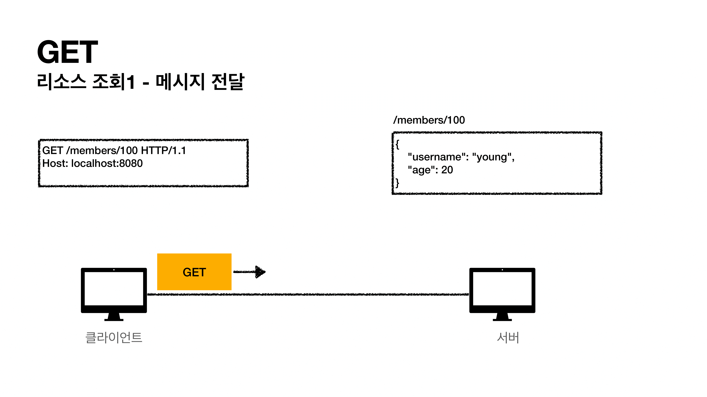

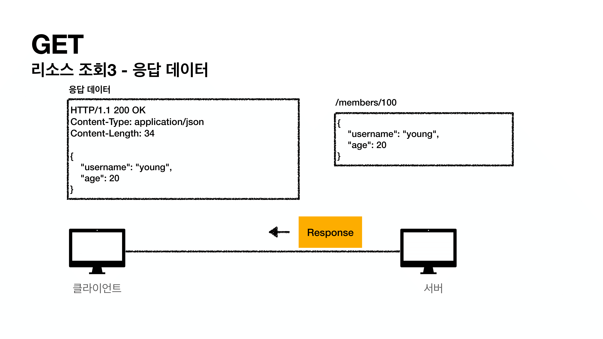


### POST

- 요청 데이터를 처리
- **메시지 바디**를 통해 서버로 요청 데이터 전달
- 서버는 요청 데이터를 처리
  - 메시지 바디를 통해 들어온 데이터를 처리하는 모든 기능을 수행한다.
- 주로 전달된 데이터로 신규 리소스 등록, 프로세스 처리에 사용

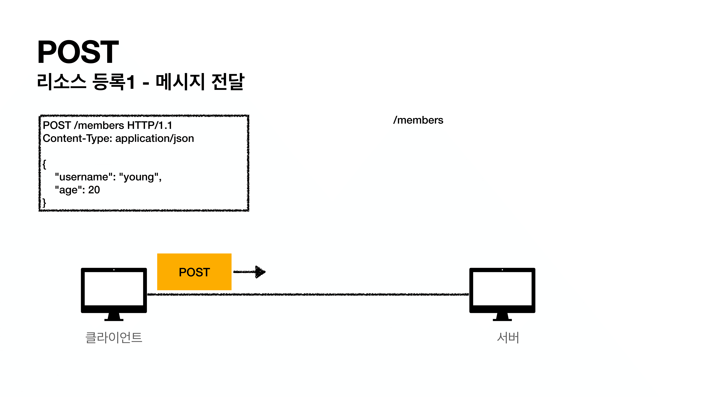

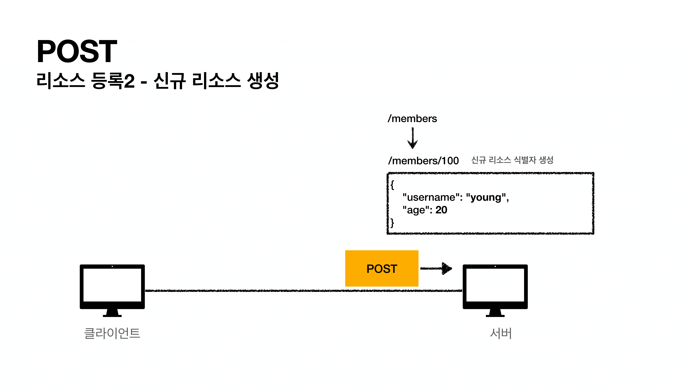

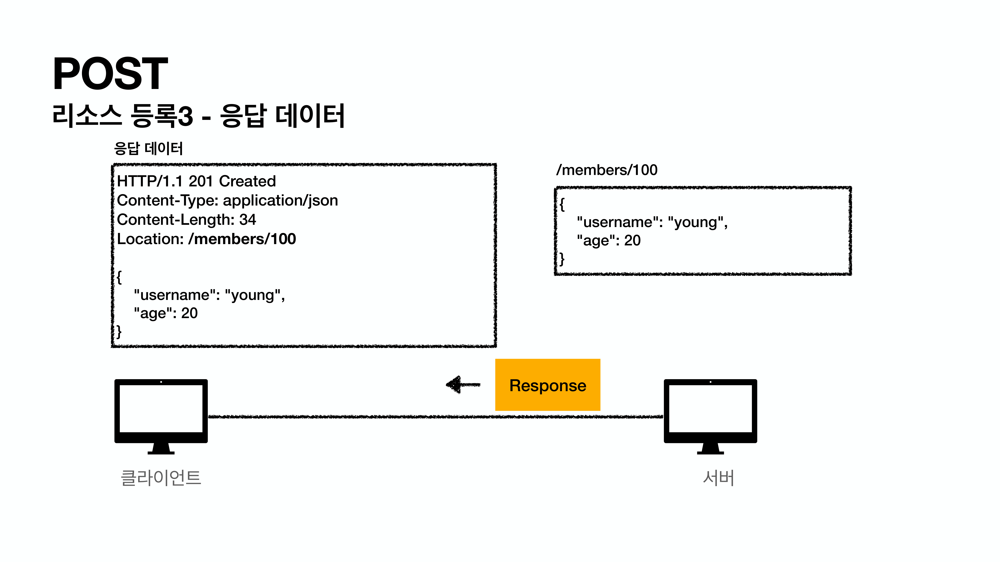

- 보통 `201 Created`로 응답
- 자원이 생성된 URI 경로를 보내준다.
- 등록된 자원의 데이터도 보내준다.


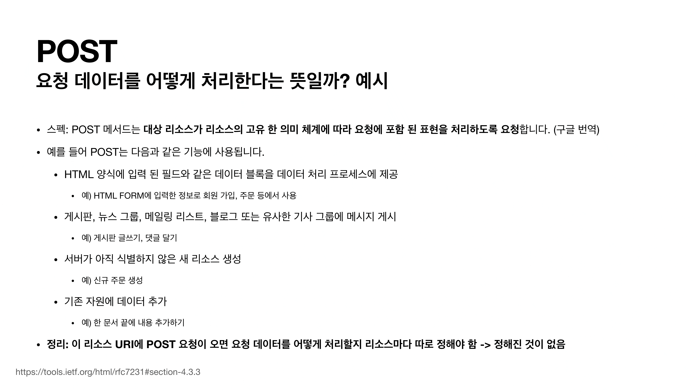


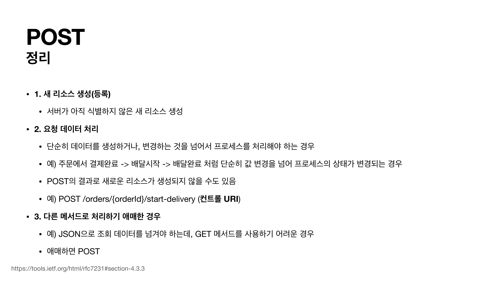

- URI에 어쩔 수 없이 행위를 넣을 수도 있습니다. ( **컨트롤 URI** )

- 조회이지만 GET 메서드의 Body에 데이터를 넣어야 할 경우 POST를 사용합니다.
  - 지원안하는 서버가 대부분...


### 3. PUT, PATCH, DELETE

### PUT

- 리소스를 대체하는 것
  - 리소스가 있으면 대체
  - 리소스가 없으면 생성
  - 쉽게 이야기해서 덮어버림! (**완전히 대체**)
- **중요! 클라이언트가 리소스를 식별** = 클라이언트가 리소스 전체 경로를 알고 있다.
  - Header : **PUT /members/100 HTTP/1.1**
  - 클라이언트가 리소스 위치를 열고 URI 지정
  - POST와 차이점 ( POST는 정확히 모른다.. 어디에 만들어 질지..)

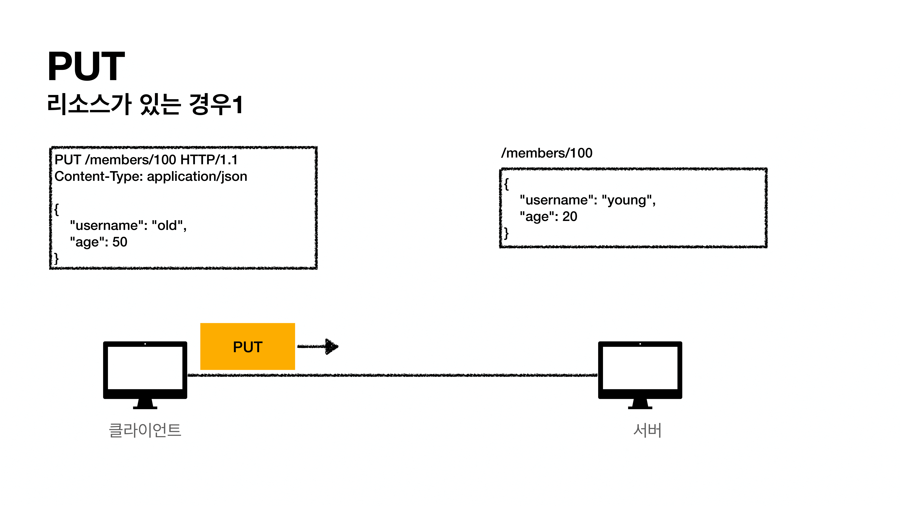


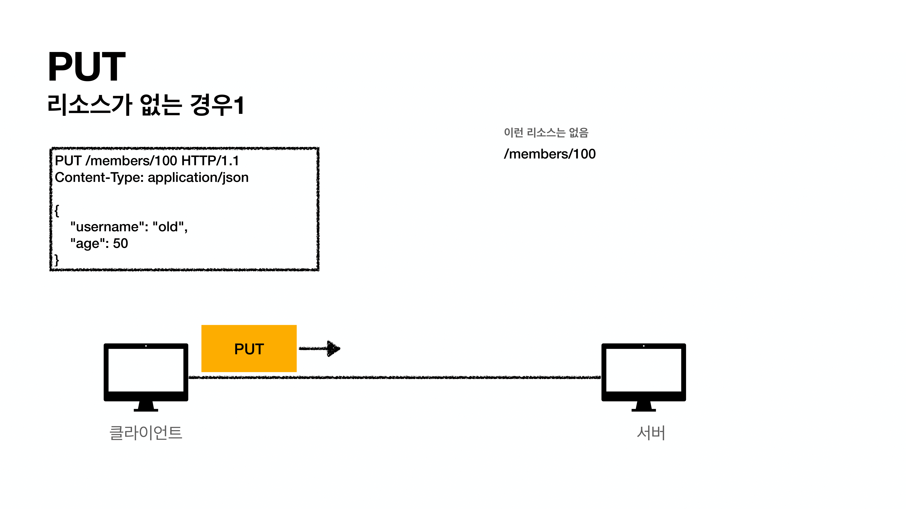

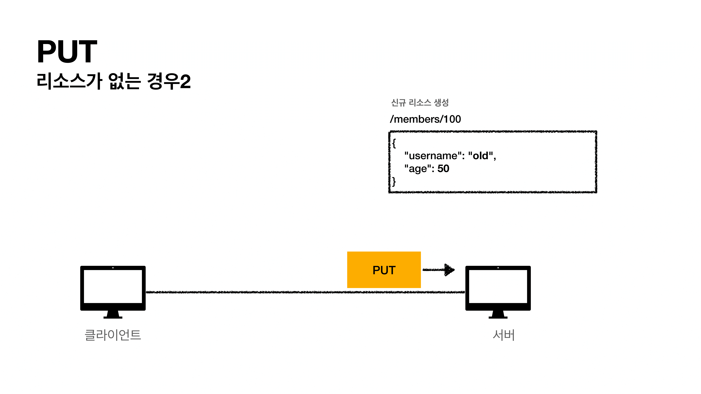

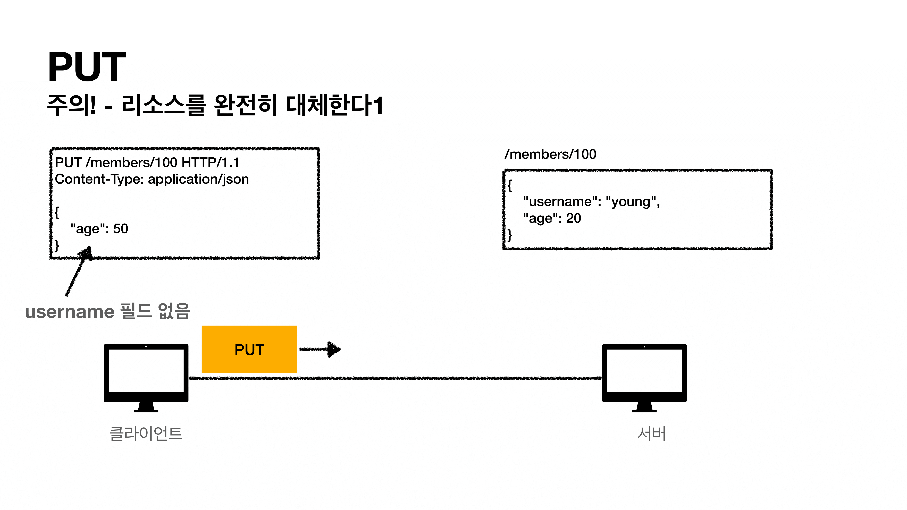

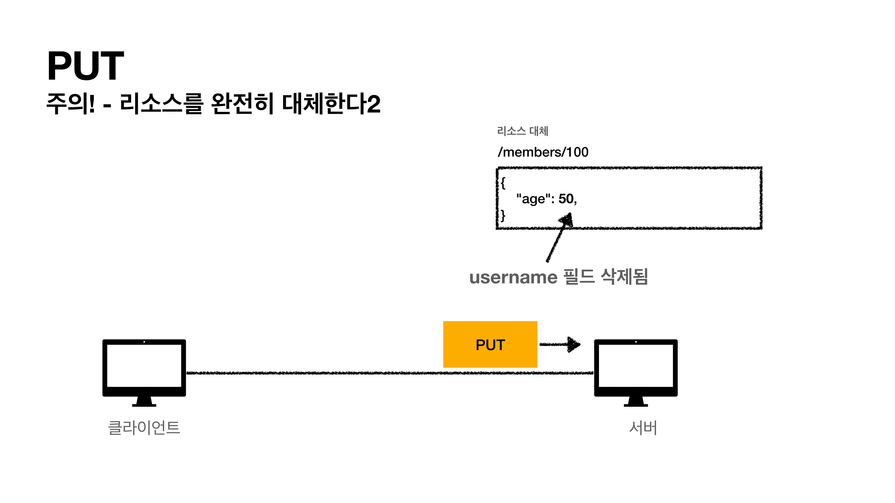

- 기존 리소스를 덮어버리기 때문에 `username`필드가 없어져버린다.
  - 이러면 리소스를 수정하기 어렵기 때문에 수정할 때 사용하는 것이 아니다.
  - 리소스를 부분 변경할 때에는 PATCH를 사용합니다.


### PATCH

- 리소스 부분 변경
- PATCH가 지원을 안하는 서버가 있을 수도 있다.
  - 이런 경우에는 무적인 POST를 사용하면 됩니다.

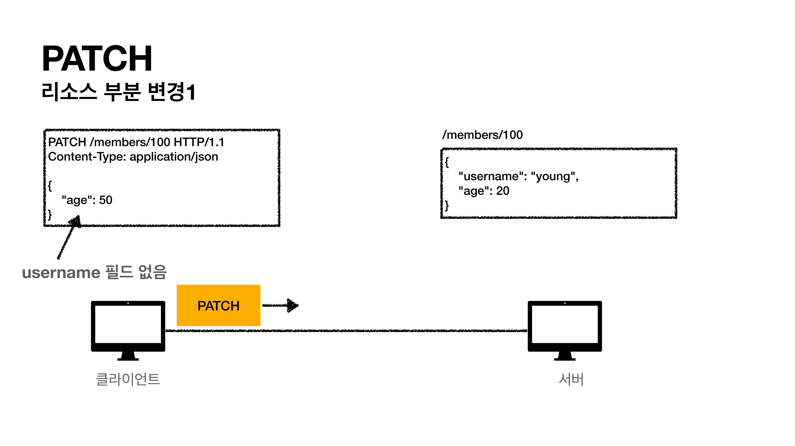

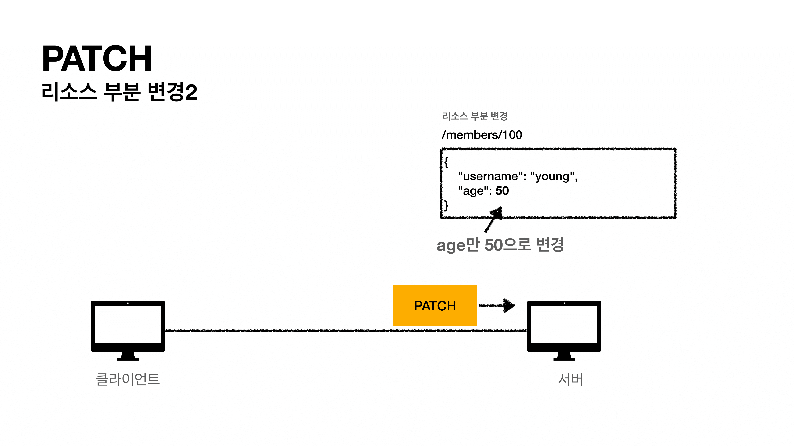

### 

DELETE

- 리소스 제거

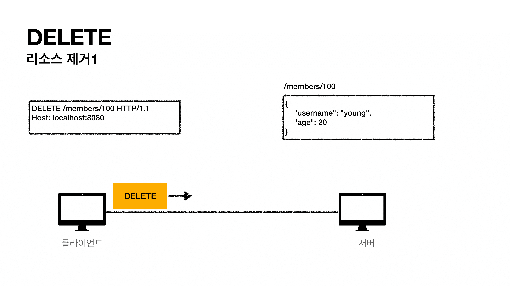

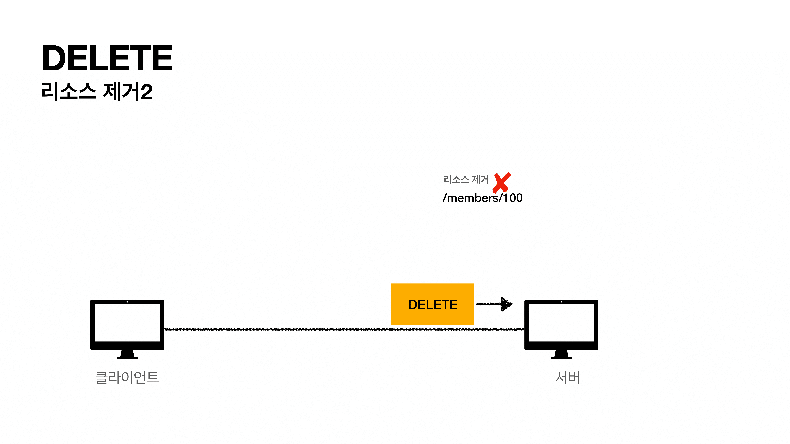


### 4. HTTP 메서드의 속성

- 안전(Safe Methods)
- 멱등(Idempotent Methods)
- 캐시가능(Cacheable Methods)

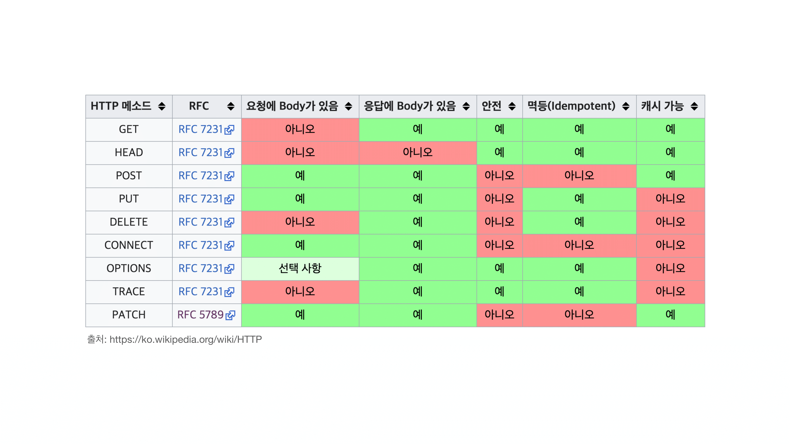

### 안전

- 호출해도 리소스를 변경하지 않습니다 = **안전 (GET)**
  - POST, PUT, DELETE 는 안전하지 않다.
  - Q : 그래도 계속 호출해서, 로그 같은게 쌓여서 장애가 발생하면요?
  - A : 안전은 해당 리소스만 고려한다. 그런 부분까지 고려하지 않는다.


### 멱등

- f(f(x)) = f(x)
- 한 번 호출하든 두 번 호출하든 100번 호출하든 결과가 똑같다.
- 멱등 메서드
  - GET : 한번 조회하든, 두 번 조회하든 같은 결과가 조회된다.
  - PUT : 결과를 대체한다. 따라서 같은 요청을 여러번 해도 최종 결과는 같다.
  - DELETE : 결과를 삭제한다. 같은 요청을 여러번 해도 삭제된 결과는 똑같다.
  - **POST : 멱등이 아니다!** 두 번 호출하면 같은 결제가 중복해서 발생할 수 있다.
    - PATCH는 멱등이거나 멱등이 아닐 수 있다.
    - 단순히 이름변경은 멱등, 특정 부분을 더해가면서 갱신은 멱등하지 않다.
- 활용
  - 자동 복구 메커니즘
  - 서버가 TIMEOUT 등으로 정상 응답을 못주었을 때, 클라이언트가 같은 요청을 다시 해도 되는가? 판단 근거가 됩니다. = 멱등하기 때문에...
- 그럼 다른 경우
  - 재요청 중간에 다른 곳에서 리소스를 변경해버리면?
    - 사용자 1 : GET => username:A, age:20
    - 사용자 2 : PUT => username:A, age:30
    - 사용자 1 : GET => username:A, age:30 => 사용자 2 영향으로 데이터가 바뀐 것으로 조회
  - **멱등은 외부 요인으로 중간에 리소스가 변경되는 것 까지는 고려하지 않습니다.** 혼자 여러번 보낼 때 적용!


### 캐시가능 ( 중요 )

- 응답 결과 리소스를 캐시해서 사용해도 되는가?
  - 우리가 웹브라우저에 이미지 큰 것을 요청했다 => 그 이미지를 또 요청할 필요가 없다 => 이것을 로컬PC의 웹브라우저가 저장하고 있다.
- 스펙상 GET, HEAD, POST, PATCH 캐시 가능
- 실제로는 GET, HEAD 정도만 캐시로 사용
  - POST, PATCH는 본문 내용까지 캐시 키로 고려해야 하는데, 구현이 쉽지 않다.
  - 캐시를 하려면 키가 맞아야 하는데( 똑같은 리소스랑 ) POST는 Body안에 데이터를 보내기 때문에 복잡하다.
  - 그래서 대부분 구현 안되어 있다.
  - GET은 URL만 키로 잡아서 쉽게 구현 가능!