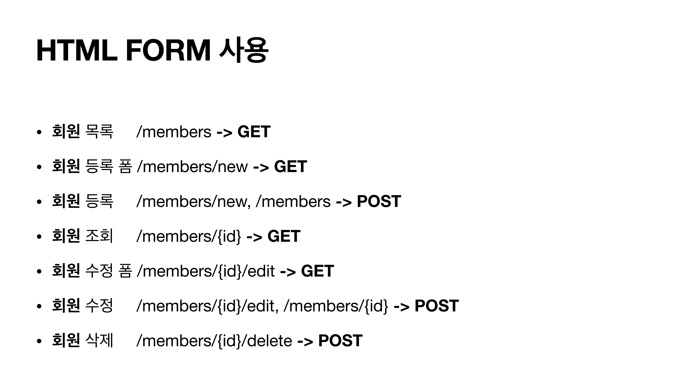

# HTTP 메서드 활용

### 1. 클라이언트에서 서버로 데이터 전송 ( 전달 방식 크게 2가지 )

- 쿼리 파라미터를 통한 데이터 전송
  - GET
  - 주로 정렬 필터(검색어)
- 메세지 바디를 통한 데이터 전송
  - POST, PUT, PATCH
  - 회원가입, 상품주문, 리소스등록, 리소스변경

### 2. 클라이언트에서 서버로 데이터 전송 4가지 상황

- 정적 데이터 조회 
  - 이미지, 정적 텍스트 문서
  - 정적 데이터는 일반적으로 쿼리 파라미터 없이 리소스 경로로 단순하게 조회 가능
  - 조회는 GET 사용

- 동적 데이터 조회
  - 주로 검색, 게시판 목록에서 정렬 필터(검색어)
    - 조회 조건을 줄여주는 필터, 조회 결과를 정렬하는 정렬 조건에 주로 사용
  - 서버에서 KET, VALUE로 꺼내어 해당하는 결과로 응답합니다.
  - 조회는 GET 사용
  - GET은 쿼리 파라미터를 사용해서 데이터를 전달

- HTML Form을 통한 데이터 전송
  - 회원가입, 상품주문, 데이터 변경
  - `submit`을 통해 전송을 하면 웹브라우저가 HTTP 메새지를 생성해줍니다.
  - Form 데이터를 GET으로 보내면 쿼리파라미터로 자동으로 웹브라우저가 바꿔줍니다.
  - `multipart/form-data` 를 활용해 파일과 함께 전송할 수 있습니다.
    - boundary가 경계를 바탕으로 데이터를 올바르게 잘라줍니다.
    - 즉 여러 타입의 데이터를 한번에 전송할 수 있습니다.

- HTTP API를 통한 데이터 전송
  - 회원 가입, 상품 주문, 데이터 변경
  - 서버 TO 서버, 앱 클라이언트, 웹 클라이언트(Ajax)

- 본인이 직접 `json`데이터를 만들고 `Content-Type`을 정해줘서 전송하면 됩니다.

- 예전에는 xml를 자주 사용했지만 닫는태그 등을 사용해야하고 이해하기에도 불편해서 json을 주로 사용

- 응답결과로 HTML을 전달 받는 것이 폼데이터, 응답 결과로 데이터를 전달 받는 것이 HTTP API통신으로 이해하면 좋습니다.

  - 보통 폼데이터로 전송하는 이유는 응답결과를 HTML로 받을 때 주로 사용
  - 물론 서버에서 강제로 데이터를 반환할 수 있다.

- HTTP API는 HTTP를 사용해서 서로 정해둔 스펙으로 데이터를 주고 받으며 통신하는 것으로 이해하면 된다.

- 반면에 REST API는 HTTP API에 여러가지 제약 조건이 추가됩니다.

- REST는 다음 4가지 제약조건을 만족해야 합니다.

  - 자원의 식별

  - 메시지를 통한 리소스 조작

  - 자기서술적 메서지

  - 애플리케이션의 상태에 대한 엔진으로서 하이퍼미디어

  - 여러가지가 있지만 대표적으로 구현하기 어려운 부분이 마지막에 있는 부분인데요. 이것은 HTML처럼 하이퍼링크가 추가되어서 다음에 어떤 API를 호출해야 하는지를 해당 링크를 통해서 받을 수 있어야 합니다.

  - 그리고 이런 부분을 완벽하게 지키면서 개발하는 것을 RESTful API라고 하는데요. 실무에서 이런 방법으로 개발하는 것은 현실적으로 어렵고, 또 추가 개발 비용대비 효과가 있는 것도 아닙니다.

  - 그런데 이미 많은 사람들이 해당 조건을 지키지 않아도 REST API라고 하기 때문에, HTTP API나 REST API를 거의 같은 의미로 사용하고 있습니다. 하지만 앞서 말씀드린 것 처럼 엄격하게 위의 내용들을 모두 지켜야 REST API라고 할 수 있습니다.

### 3. HTTP API 설계 예시

- HTTP API - 컬렉션
  - POST 기반 등록
  - 예) 회원 관리 API 제공
- HTTP API - 스토어
  - PUT 기반 등록
  - 예) 정적 컨텐츠 관리, 원격 파일 관리
- HTML FORM 사용
  - 웹 페이지 회원 관리
  - GET, POST만 지원

- API 설계 특징 : 리소스(미네랄 자체, 캐다는 X)만 식별해야 한다.
  - 캐다는 HTTP Method를 활용

- 파일은 존재하면 지우고 덮어씌우기 위해 PUT 활용
- 임의로 무적인 POST를 활용하여 대량의 등록으로 활용

- POST로 등록할 때에는 클라이언트가 리소스 위치를 몰랐는데 PUT은 알고 있어야 하고 직접 관리해야합니다.
- 대부분 POST를 활용하고 PUT은 거의 사용하지 않습니다.

