# HTTP 상태코드

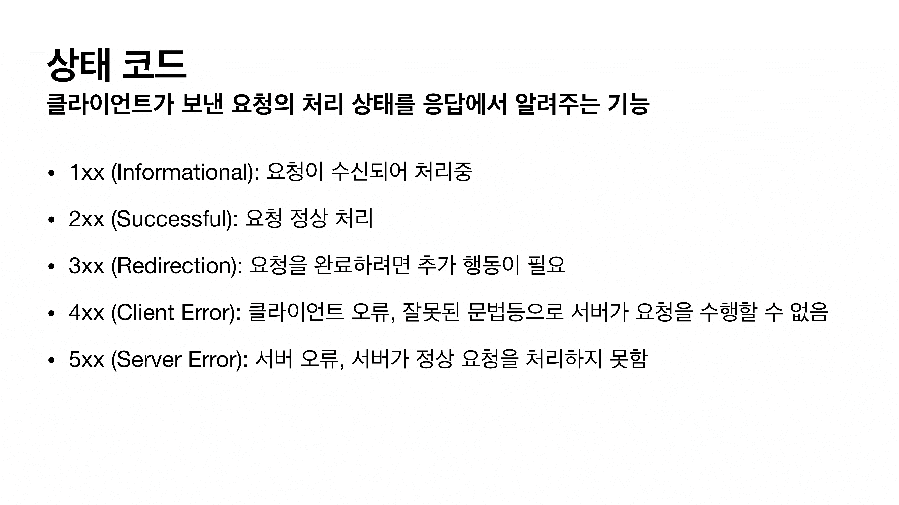

### 만약에 모르는 상태 코드가 나타나면?

- 클라이언트가 인식할 수 없는 상태코드를 서버가 반환하면?
  - 클라이언트는 상위 상태코드로 해석해서 처리합니다.
- 미래에 새로운 상태코드가 추가되어도 클라이언트를 변경하지 않아도 됩니다.
  - 299 ??? => 2xx (Successful)
  - 451 ??? => 4xx (Client Error)
  - 599 ??? => 5xx (Server Error)

### 1. 1xx (Informational)

- 요청이 수신되어 처리중
- 거의 사용하지 않습니다.

### 2. 2xx - 성공

- 클라이언트의 요청을 성공적으로 처리
  - 200 OK
  - 201 Created 
  - 202 Accepted
  - 204 No Content

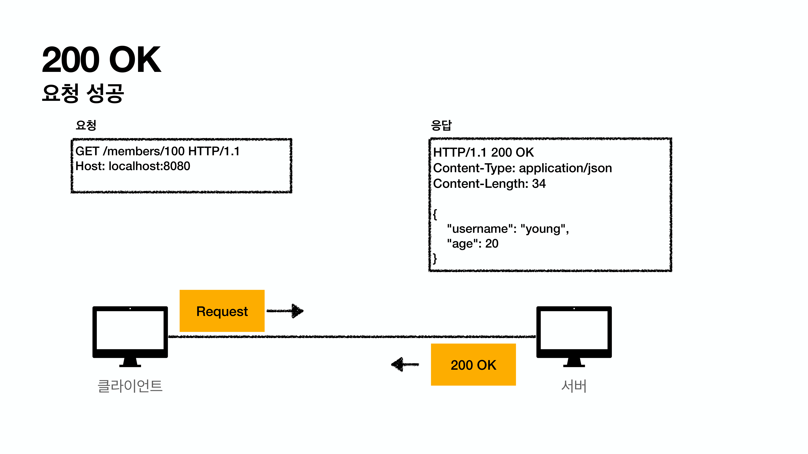

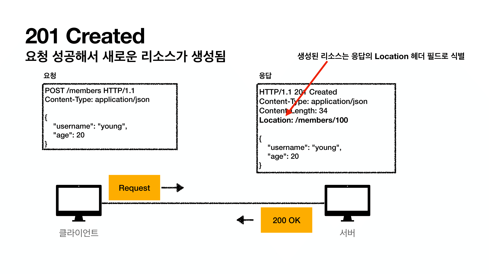

- 202 Accepted
  - 요청이 접수되었으나 처리가 완료되지 않았음
    - 배치 처리 같은 곳에 사용
    - 예) 요청 접수 후 1시간 뒤에 배치 프로세스가 요청을 처리함

- 204 No Content
  - 서버가 요청을 성공적으로 수행했지만, 응답 페이로드 본문에 보낼 데이터가 없음
  - 예) 웹 문서 편집기에서 save 버튼
  - save 버튼의 결과로 아무 내용이 없어도 됩니다.
  - save 버튼을 눌러도 같은 화면을 유지해야 합니다.
  - 결과 내용이 없어도 204 메시지(2xx)만으로 성공을 인식할 수 있습니다.

### 3. 3xx (Redirection)

- 요청을 완료하기 위해 유저 에이전트(웹브라우저 등)의 추가 조치 필요
  - 300 Multiple Choices
  - 301 Moved Permanently
  - 302 FOund
  - 303 See Other
  - 304 Not Modified
  - 307 Temporary Redirect
  - 308 Permanent Redirect

### 리다이렉션의 이해

- 웹 브라우저는 3xx 응답의 결과에 Location 헤더가 있으면, Location 위치로 자동 이동합니다. ( 리다이렉트 )

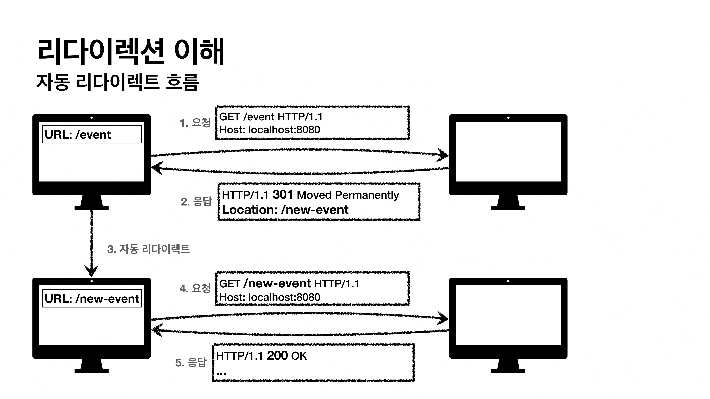

- 특정 evnet 경로가 바뀌었을 때 사용

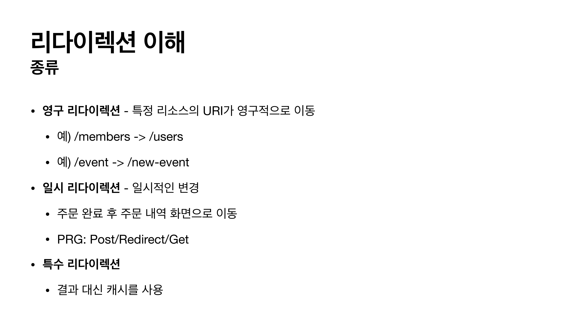

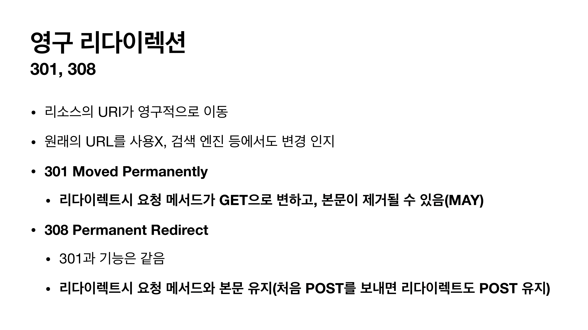

- 과거에는 처음 스펙에는 당연히 post로 보내면 post로 리다이렉트 할 줄 알았는데 브라우저들이 get으로 보내버린 것..
- 그래서 스펙을 변경한 것..

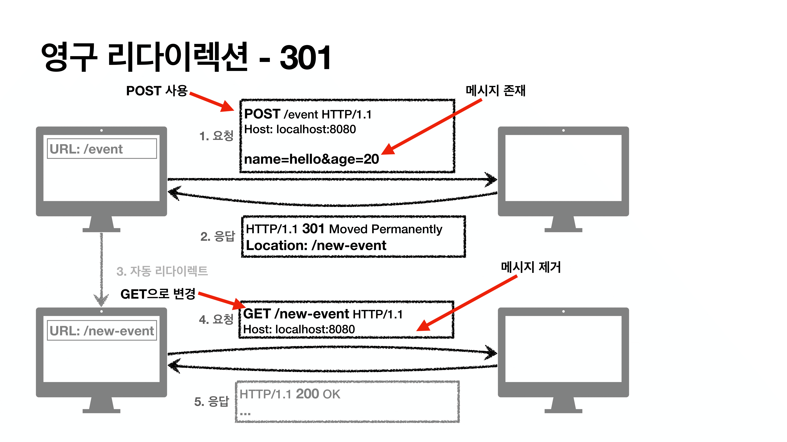

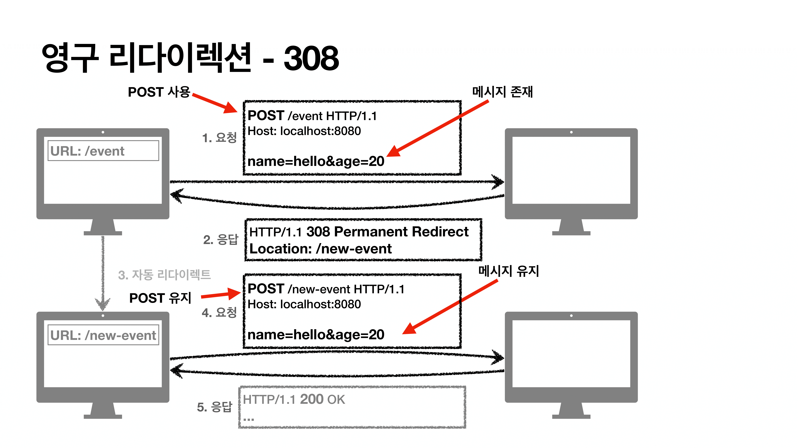

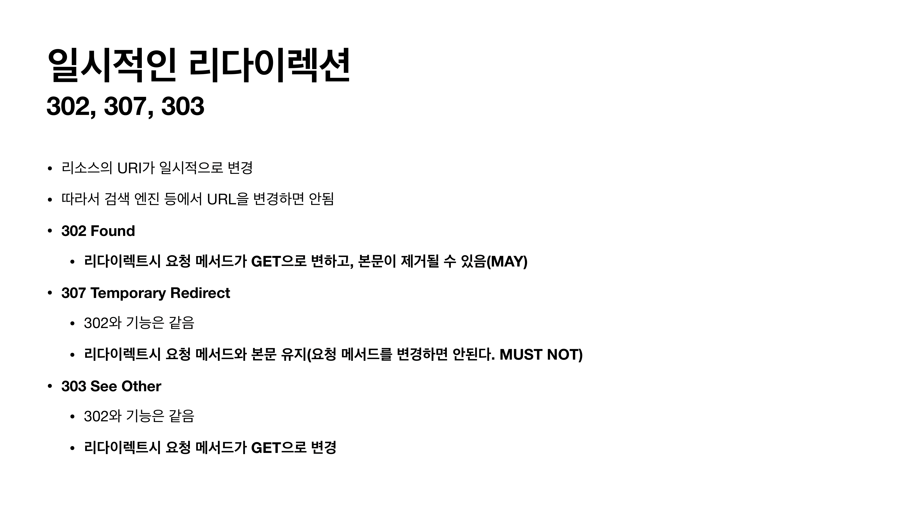

- 명확하지 않은 `302`때문에 `303`이 나왔습니다.

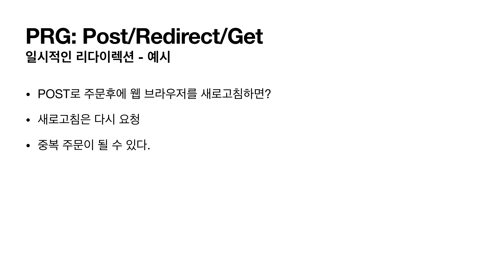

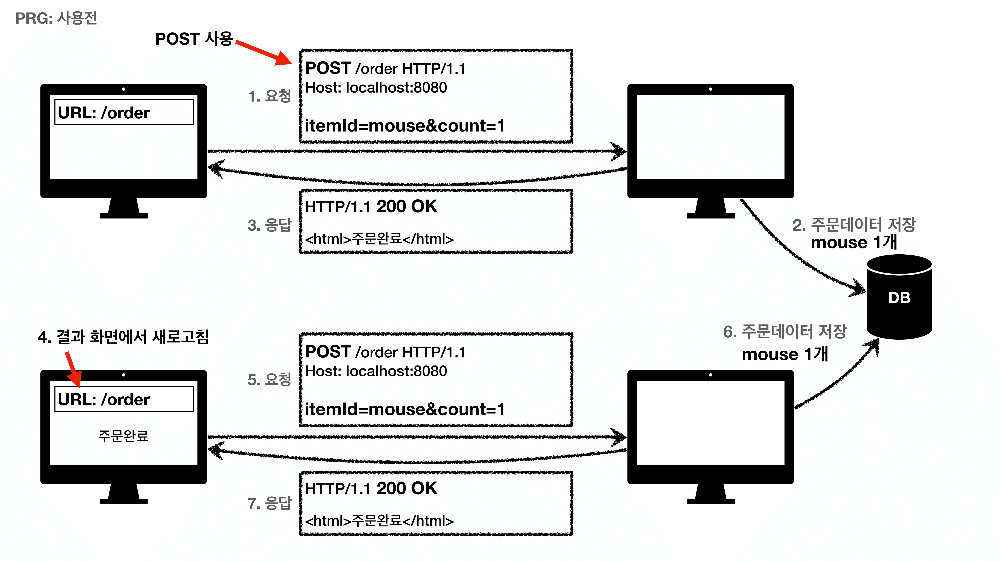

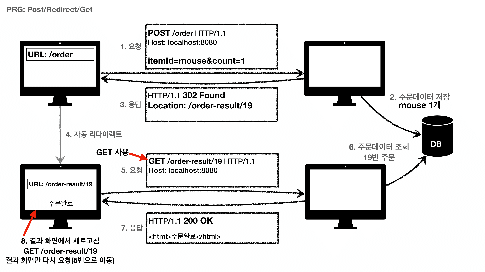

- 원칙적으로 서버에서 막아야하나 클라이언트에서도 같이 해결 할 수 있습니다. ( 사용자 사용성 개선, 서버도 오류 개선 )
- POST로 주문후에 새로 고침으로 인한 중복 주문 방지
- POST로 주문후에 주문 결과 화면을 GET 메서드로 리다이렉트
- 새로고침해도 결과 화면을 GET으로 조회
- 중복 주문 대신에 결과 화면만 GET으로 다시 요청
- PRG 이후 리다이렉트
  - URL이 이미 POST => GET으로 리다이렉트 됨
  - 새로 고침 해도 GET으로 결과 화면만 조회

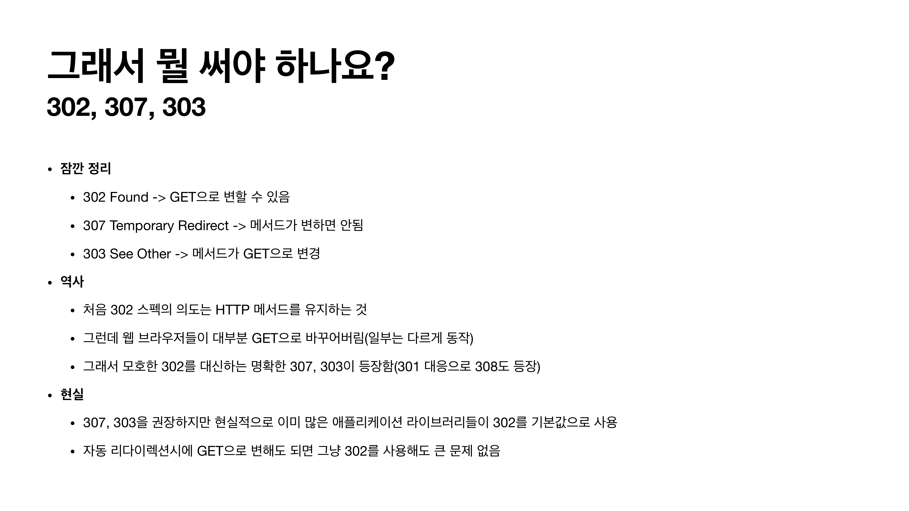

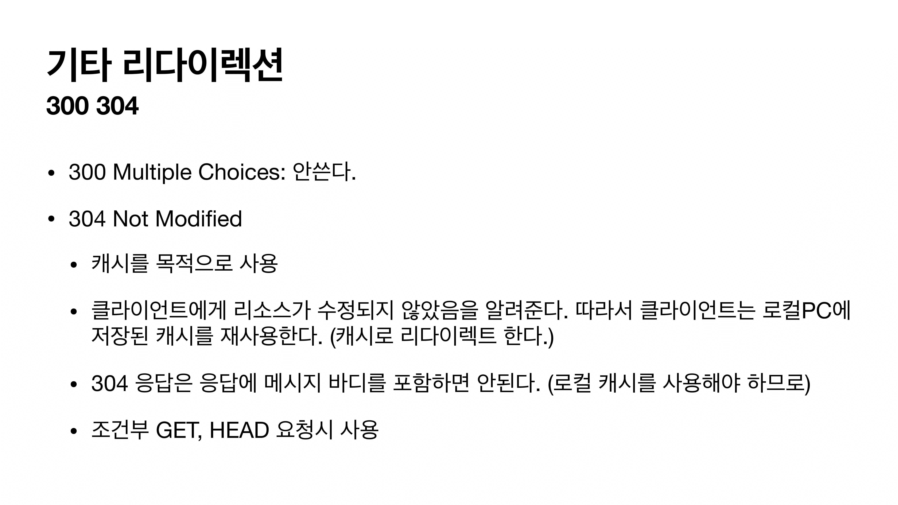

- 클라이언트에서 서버에게 캐시 완료된 것 같은데 이거 사용해도 될까? 라고 물어보면 서버가 캐시 유요하다 사용해도 된다라고 알려주는 것이다. ( 이미지를 다시 받을 필요가 없어진다. 네트워크 용량 감소 )

### 4. 4xx (클라이언트 오류), 5XX (서버오류)

### 4xx (Client Error)

- 클라이언트의 요청에 잘못된 문법등으로 서버가 요청을 수행할 수 없음
- 오류의 원인이 클라이언트에 있음
- 중요! 클라이언트가 이미 잘못된 요청, 데이터를 보내고 있기 때문에, 똑같은 재시도가 실패함

- 400 Bad Request
  - 클라이언트가 잘못된 요청을 해서 서버가 요청을 처리할 수 없음
    - 요청 구문, 메시지 등등 오류
    - 클라이언트는 요청 내용을 다시 검토하고, 보내야함
    - 예) 요청 파라미터가 잘못되거나, API 스펙이 맞지 않을 때
- 401 Unauthorized
  - 클라이언트가 해당 리소스에 대한 인증이 필요함
    - 인증되지 않음
    - 401 오류 발생시 응답에 WWW-Authenticate 헤더와 함께 인증 방법을 설명
    - 참고
      - 인증(Authentication): 본인이 누구인지 확인, (로그인)
      - 인가(Authorization): 권한부여 (ADMIN 권한처럼 특정 리소스에 접근할 수 있는 권한, 인증이 있어야 인가가 있음)
      - 오류 메시지가 Unauthorized 이지만 인증 되지 않음 (이름이 아쉬움)

- 403 Forbidden
  - 서버가 요청을 이해했지만 승인을 거부함
    - 주로 인증 자격 증명은 있지만, 접근 권한이 불충분한 경우
    - 예) 어드민 등급이 아닌 사용자가 로그인은 했지만, 어드민 등급의 리소스에 접근하는 경우
- 404 Not Found
  - 요청 리소스를 찾을 수 없음
    - 요렁 리소스가 서버에 없음
    - 또는 클라이언트가 권한이 부족한 리소스에 접근할 때 해당 리소스를 숨기고 싶을 때

### 5xx (Servoer Error)

- 서버 문제로 오류 발생
- 서버에 문제가 있기 때문에 재시도 하면 성공할 수도 있음(복구가 되거나 등등...)
- 왠만하면 서버에서 500 에러를 만들면 안됩니다.
  - 정말 심각한 문제, 서버에 문제가 있을 때에만.. 사용하기!
  - 만약 API 스펙은 만족했지만 비즈니스 로직의 결과가 성종적으로 처리되지 않을 경우(보험금 등) 내부적으로 봉투패턴을 활용해서 비즈니스 로직의 응답 코드를 정의에 함께 200과 전달해서 500에러 내지 않기!
- 500 Internal Server Error
  - 서버 문제로 오류 발생, 애매하면 500 오류
  - 서버 내부 문제로 오류 발생

- 503 Service Unavailable
  - 서비스 이용 불가
  - 서버가 일시적인 과부하 또는 예정된 작업으로 잠시 요청을 처리할 수 없음
  - Retry-After 헤더 필드로 얼마뒤에 복구되는지 보낼 수도 있음