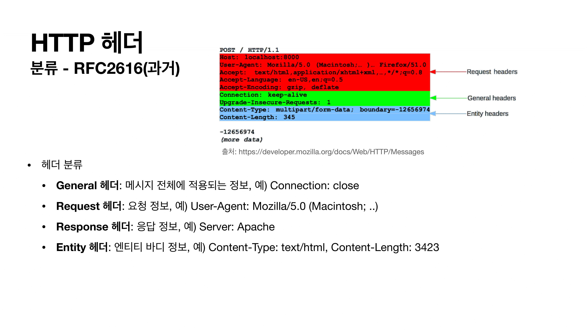

# 7. HTTP 헤더 ( 일반 )

- HTTP  표준
  - 1999년 **RFC2161**은 폐기가 됩니다.
  - 2014년 RFC7230~7235 등장
- RFC723x 변화
  - 엔티디(Entity) => 표현(Representation)
  - Representation = representation Metadata + Representation Data
    - 표현 = 표현 메타데이터 + 표현 데이터

### 1. 표현

- 실제 회원 리소스가 있으면 이것을 `Json`으로 표현해서 전송 or `html`로 표현해서 전송

- identity : 압축을 안한다는 뜻

### 2. 콘텐츠 협상

- 협상 = 콘텐츠 네고시에이션

- 클라이언트가 선호하는 표현 요청 ( 클라이언트가 서버에게 )
  - 서버가 못 줄수도 있다. 요청만 하는거!
- Accept : 클라이언트가 선호하는 미디어 타입 전달
- Accept-Charset : 클라이언트가 선호하는 문자 인코딩
- Accept-Encoding : 클라이언트가 선호하는 압축 인코딩
- Accept-Language : 클라이언트가 선호하는 자연 언어
- 협상 헤더는 요청시에만 사용

- 나는 한국어를 원하지만 없으면 영어를 원한다면?
  - 하지만 따로 설정하지 않으면 독일어를 보냅니다. ( 지원안하기 때문에 )
  - 그래서 우선순위를 통해 설정할 수 있습니다.

- 브라우저가 자동으로 퀄리티값을 넣어줍니다.

### 3. 전송 방식

- 단순 전송
- 압축 전송
- 분할 전송
- 범위 전송

- Content-Length를 알 고 있을 때 그냥 주면 됩니다.

- 서버에서 `gzip`으로 압축하고 무엇으로 압축했는지 표시해줍니다.

- chunked ( 덩어리 ) : 덩어리로 쪼개서 보낸다는 의미
- Transfer-Encoding 사용 => Content-Length를 넣으면 안됩니다. ( 예측 불가 )
- 용량이 클 때 분할해서 전송하면 하나씩 받아서 미리 먼저 받아볼 수 있습니다.

- 이미지를 받을 때 중간에 절반정도 받았다가 끊겼을 때 => 처음부터 다시 요청하면 비효율적이니 나머지 절반만 다시 요청해서 나머지를 받을 수 있습니다.
- 범위전송은 실제 전송된 데이터의 길이를 Content-Length로 남기면 됩니다. (RFC7233 참고)

### 4. 일반 정보

- From : 유저 에이전트의 이메일 정보
- Referer : 이전 웹 페이지 주소
- User-Agent : 유저 에이전트 애플리케이션 정보
- Server : 요청을 처리하는 오리진 서버의 소프트웨어 정보
- Date : 메세지가 생성된 날짜

### 4.1 From

- 유저 에이전트의 이메일 정보
  - 일반적으로 잘 사용되지 않음
  - 검색 엔진 같은 곳에서, 주로 사용
    - 내 사이트를 크롤링하는 검색엔진에게 연락해서 하지말라고 연락할 때...
  - 요청에서 사용

### 4.2 Referer

- 이전 웹 페이지 주소
- 현재 요청된 페이지의 이전 웹 페이지 주소
- A => B로 이동하는 경우 B를 요청할 때 Reverer: A를 포함해서 요청
- Referer를 사용해서 유입 경로 분석 가능
- 요청에서 사용
- 참고: referer는 단어 referrer의 오타
  - 이미 오타인채로 사용되어져서.. 그냥 사용중..

### 4.3 User-Agent

- 유저 에이전트 애플리케이션 정보
  - user-agent : `Mozilla/5.0 (Windows NT 10.0; Win64; x64) AppleWebKit/537.36 (KHTML, like Gecko) Chrome/89.0.4389.82 Safari/537.36`
- 클라이언트의 애플리케이션 정보(웹 브라우저 정보, 등등)
- 통계 정보를 뽑을 수 있다.
- 어떤 종류의 브라우저에서 장애가 발생하는지 파악 가능
- 요청에서 사용

### 4.4 Server

- 요청을 처리하는 ORIGIN 서버의 소프트웨어 정보
  - ORIGIN 서버 : http 요청을 보내게 되면 많은 프록시 서버를 거치게 되는데 실제 나의 요청이 도착해서 응답을 해주는 서버
- Server : Apache/2.2.22 (Debian)
- server : nginx
- 응답에서 사용

### 4.5 Date

- 메세지가 발생한 날짜와 시간
- Date : `Tue, 15 Nov 1994 08:12:31 GMT`
- 응답에서 사용 ( 과거에는 요청에서도 사용했지만 최신스펙은 응답에만 사용 )

### 5. 특별한 정보

- Host : 요청한 호스트 정보( 도메인 )
- Location : 페이지 리다이렉션
- Allow : 허용 가능한 HTTP 메서드
- Retry-After : 유저 에이전트가 다음 요청을 하기까지 기다려야 하는 시간

### 

### 5-1 Host

- 요청한 호스트 정보 ( 도메인 )
- 요청에서 사용
- 필수 값
- 하나의 서버가 여러 도메인을 처리해야 할 때
- 하나의 IP 주소에 여러 도메인이 적용되어 있을 때

- IP로만 TCP 연결을 통해 통신을 하기 때문에 서버는 어떤 도메인인지 구분할 수가 없습니다.
  - 초창기에는 문제가 많았습니다.

### 5-2 Location

- 페이지 리다이렉션
- 웹 브라우저는 3xx 응답의 결과에 Location 헤더가 있으면 , Location 위치로 자동 이동 ( 리다이렉트 )
- 응답 코드 3xx 설명 참고
- 201 (Created): Location 값은 요청에 의해 생성된 리소스 URI
- 3xx (Redirecton) : Location 값은 요청을 자동으로 리다이렉션하기 위한 대상 리소스를 가리킴

### 5-3 Allow

- 허용 가능한 HTTP 메서드
- 405 (Method Not Allowed) 에서 응답에 포함해야함
- Allow : GET, HEAD, PUT

### 5-4 Retry-After

- 유저 에이전트가 다음 요청을 하기까지 기다려야 하는 시간
- 503 (Service Unavailable) : 서비스가 언제까지 불능인지 알려 줄 수 있음
- Retry-After : Fri, 31 Dec 1999 23:59:59 GMT (날짜표기)
- Retry-After: 120 (초단위 표기)

### 6. 인증

- Authorization : 클라이언트 인증 정보를 서버에 전달
- WWW-Authenticate : 리소스 접근시 필요한 인증 방법 정의

### 6-1 Authorization

- 클라이언트 인증 정보를 서버에 전달
- Authorization : Basic xxxxxxxxxxxxxxx

### 6-2 WWW-Authenticate

- 리소스 접근시 필요한 인증 방법 정의
- 401 Unauthorized 응답과 함께 사용
- WWW-Authenticate : `Newauth realm="apps", type=1, title="Login to \ "apps\"", Basic realm="semple"`
  - 이러한 정보를 참고해서 인증정보를 만들어라!

### 7. 쿠키

- Set-Cookie : 서버에서 클라이언트로 쿠키 전달(응답)
- Cookie : 클라이언트가 서버에서 받은 쿠키를 저장하고, HTTP 요청시 서버로 전달

- 서버입장에서는 HTTP 메시지를 보면 로그인했는지 알 수가 없습니다.
- HTTP는 무상태 프로토콜이기 때문입니다. (Stateless)
  - 클라이언트와 서버가 요청과 응답을 주고 받으면 연결이 끊어진다.
  - 클라이언트가 다시 요청하면 서버는 이전 요청을 기억하지 못한다.
  - 클라이언트와 서버는 서로 상태를 유지하지 않는다.

- 일반적인 대안은 계속 유저정보를 서버에게 주는 것입니다.
  - 보안 문제 등 많은 문제 발생...

- 모든 요청에 사용자 정보를 포함되도록 개발 해야합니다.
  - 브라우저를 완전히 종료하고 다시 열면
    - 요즘은 웹스토리지에 저장하면 해결 가능!
- 이것을 해결하기 위해 쿠키 도입
  - 쿠키헤더사용!

- 로그인 이후 웹브라우저는 `/welcome`페이지에 들어가면 자동으로 웹브라우저는 이 서버에 요청을 보낼 때마다 쿠키를 무저건 뒤져서 쿠키값을 꺼내어 헤더에 포함시킵니다.

- 하지만 모든 정보에 쿠키를 넣어서 보내면 보안의 문제점이 있어서 제약하는 방법들이 존재합니다.

- 보안을 위해 홍길동이라는 정보를 서버에서 **세션id**로 만들어서 db에 저장해놓고 이것을 클라이언트에 반환합니다.
- 클라이언트는 세션아이디만 보내게 되고 존재하면 로그인한 유저라고 판단합니다.
- 해커에게 세션id를 탈취당하면 큰 문제가 발생하기 때문에 HTTPS를 사용해야햐고 session의 생존 기간을 짧게 가져가야 합니다.

