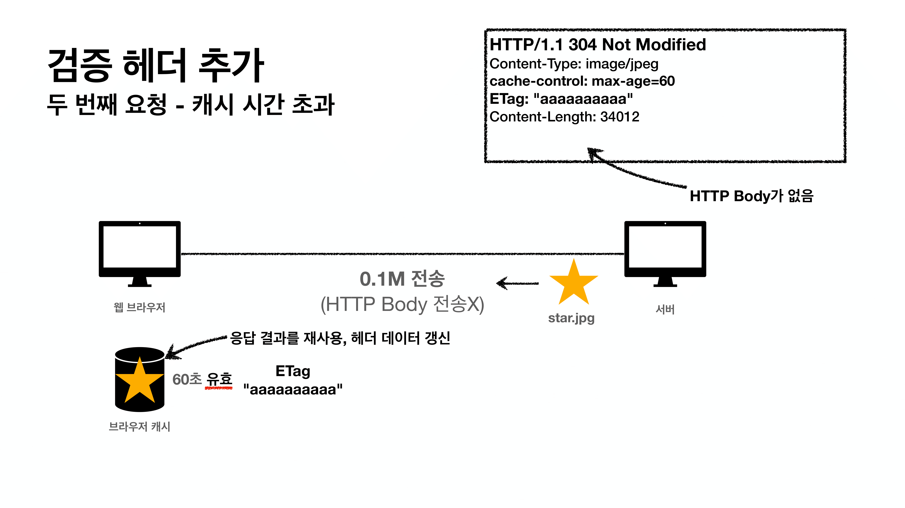
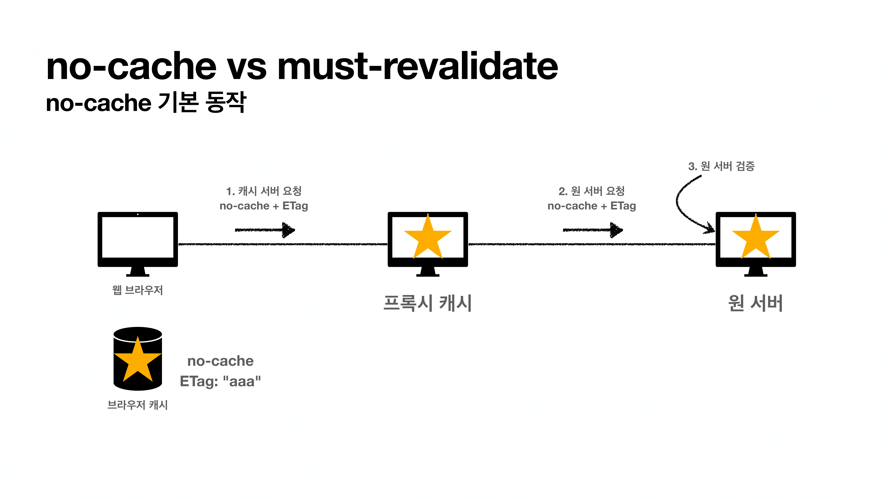

# HTTP 헤더 ( 캐시와 조건부 요청 )

### 1. 캐시 기본  동작

- 캐시가 없을 때
  - 데이터가 변경되지 않아도 계속 네트워크를 통해서 데이터를 다운로드 받아야 합니다.
  - 인터넷 네트워크는 매우 느리고 비싸다.
  - 브라우저 로딩 속도가 느리다.
  - 느린 사용자 경험
- 캐시 적용

- 60초간 캐시 유효

- 두번째 요청시 캐시를 먼저 확인합니다.

- 캐시적용
  - 캐시 덕분에 캐시 가능 시간동안 네트워크를 사용하지 않아도 된다.
  - 비싼 네트워크 사용량을 줄일 수 있다.
  - 브라우저 로딩 속도가 매우 빠르다.
  - 빠른 사용자 경험

- 캐시 시간 초과
  - 캐시 유효 시간이 초과하면, 서버를 통해 데이터를 다시 조회하고, 캐시를 갱신한다.
  - 이때 다시 네트워크 다운로드가 발생한다.
  - 그런데... 이미지가 바뀌지 않았는데.. 캐시 시간이 만료되어도 꼭 다시 요청해야할까??...

### 2. 검증 헤더와 조건부 요청 - 1

- 캐시 시간 초과
  - 캐시 유효 시간이 초과해서 서버에 다시 요청함현 다음 두 가지 상황이 나타난다.
    - 서버에서 기존 데이터를 변경함
    - 서버에서 기존 데이터를 변경하지 않음

- 마지막에 수정된 시간을 검증 헤더에 넣어서 요청합니다.

- 60초 초과후

- 304 메세지와 함께 HTTP Body 없이 전송합니다.
- 304 메세지 등 본문이 오지 않아도 `content-length`를 보낼 수 있습니다.

- 크롬 작업관리자에서 네트워크 탭에서 연한 색깔은 캐시로 불러온 데이터를 의미

### 3. 검증 헤더와 조건무 요청 - 2

- 304는 너의 캐시로 리다이렉션해서 그것을 사용해라! 라는 의미

- 서버에서 임의로 이름을 붙일 수가 있다.
  - 버전 or 해쉬

- 데이터가 수정되지 않았기 때문에 실패 = 304

### 4. 캐시와 조건부 요청 헤더

- 캐시 제어 헤더
  - Cache-Control : 캐시 제어
  - Pragma : 캐시 제어(하위 호환)
  - Expires : 캐시 유효 기간(하위 호환)

- Cache-Control ( 캐시 지시어 - directives )
  - Cache-Control: max-age
    - 캐시 유효 시간, 초 단위
  - Cache-Control: no-cache
    - 데이터는 캐시해도 되지만, 항상 원(origin) 서버에 검증하고 사용
    - 서버에서 항상 검증하고 캐시 데이터를 사용해라!
    - 중간에 눈에는 보이지 않지만 캐시 프록시 서버라는 것이 존재합니다. 이것을 거쳐서 진짜 서버에 접근하는 것입니다. 이 중간서버에서 잠깐 캐시해줄 수도 있다. 이 중간서버에서 검증하는 것이 아닌 진짜 원서버에서 검증해야 합니다.
  - Cache-Control: no-store
    - 데이터에 민감한 정보가 있으므로 저장하면 안됨 ( 메모리에서 사용하고 최대한 빨리 삭제 )
- Pragma ( 캐시 제어 - 하위호환 )
  - Pragma: no-cache
  - HTTP 1.0 하위 호환
  - 거의 사용하지 않음
- Expires ( 캐시 만료일 지정 - 하위호환 )
  - expires: Mon, 01 Jan 1990 00:00:00 GMT
  - 캐시 만료일을 정확한 날짜로 지정
  - HTTP 1.0 부터 사용
  - 지금은 더 유연한 Cache-Control: max-age 권장
    - 초로 하기 때문에 더 쉽게 계산 및 설정 가능
  - Cache-Control: max-age와 함께 사용하면 Expires는 무시

### 5. 프록시 캐시

- 거리가 너무 멀면 빛의 속도라도 오래걸린다.

- CDN 서비스의 한 종류로서 많이 하고 있습니다.
  - CDN(Content Delivery Netowrks, 콘텐츠전송 네트워크)은 콘텐츠 전송 네트워크라고 한다. CDN 사용목적은 서버 운영시 병목 현상, 및 비 효율적인 네트워크 이동을 막기 위해서라고 볼수 있습니다.
  - 예를 들어 1대의 서버를 운영중일때 상용자가 몰리거나, 과도한 트래픽이 증가하였을때 서버가 죽거나 프리징 현상이 발생하는 경우가 생기는데, CDN를 사용할 경우 데이터 속도 관련문제를 해결이 가능합니다.
- AWS는 클라우드 프론트로 서비스 하고 있습니다.
- 웹브라우저는 원 서버를 직접 가지 않고 한국에 있는 프록시 캐시 서버로 요청하라고 되어있으면 그곳으로 요청

- 예시로 유튜브 중에서 외국 영상 중 인기가 없는 영상을 보면 속도가 느립니다.
- 하지만 사람들이 많이 보는 컨텐츠를 보면 로딩속도가 엄청 빠릅니다. ( 한국 서버에서 다운로드를 받기 때문 )
- 첫번째 유저는 똑같이 느립니다.

### 6. 캐시 무효화

- 내가 캐시를 적용안하다고 해도 웹 브라우저가 임의로 `GET`요청인 경우 캐시를 해버리는 경우가 많습니다.
- 그래서 해당 페이지의 캐시를 막으려면 해당 단어를 다 넣어주면 됩니다.

- 국내 네이버는 이렇게 되어 있습니다.
- 구글은 글로벌 서비스다보니 옛날의 웹브라우저 지원을 위해 더 다양한 키워드들이 들어가 있습니다.

- 만약에 순간적으로 원 서버와 네트워크 통신이 단절될 경우 프록시 캐시에서 옛날 데이터라도 넘겨주는 설정을 할 수 있습니다. 

- 예시로 통장 잔고같은 경우는 옛날 잔고를 보여주면 안되니... must-revalidate를 활용해 확실하게 방지해야한다.

## 마지막으로

### HTTP 스펙

- RFC 2616 : https://tools.ietf.org/html/rfc2616
  - 대부분 블로그들은 이것을 보고 설명, 그래서 주의해야햠.
- RFC 7230~7235 : https://tools.ietf.org/html/rfc7230 ( 이것으로 모두 개정 )
- HTTP 완벽가이드 책 : RFC 2616 기준